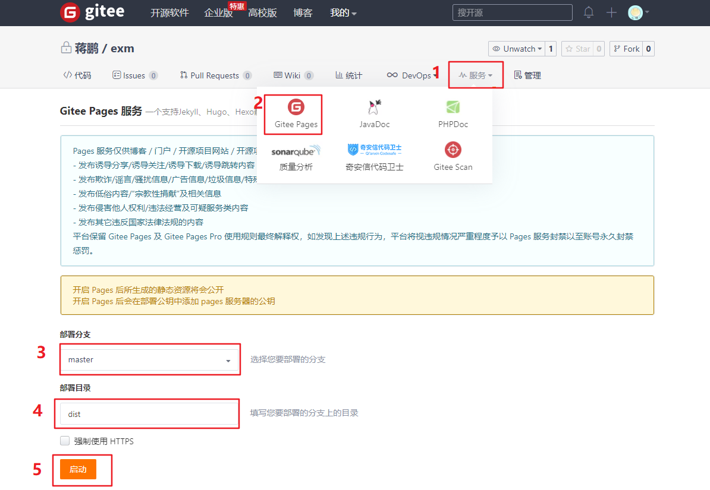
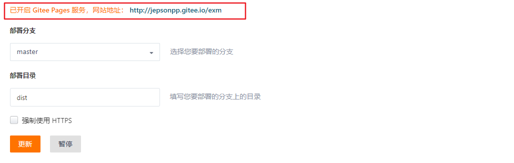

# day87

### 头像裁切

> 使用[**vue-cropper**](https://github.com/xyxiao001/vue-cropper)插件实现头像的裁剪

- 修改结构样式

  ```jsx
  <!-- 更改头像 -->
  <div class="avatar">
    <van-image fit="cover" round :src="user.photo" />
    <van-uploader class="uploader" :after-read="afterRead" />
  </div>
  <div class="mask" v-if="isShowMask">
    <VueCropper
      :img="img"
      autoCrop
      autoCropwidth="120"
      autoCropHeight="120"
      fixed
      ref="cropper"
    ></VueCropper>
    <van-button type="primary" class="confirm" @click="savePhoto">
      确定
    </van-button>
    <van-button type="primary" class="cancel" @click="isShowMask = false">
      取消
    </van-button>
  </div>
  <!-- /更改头像 -->
  
  <style lang="scss" scoped>
  .avatar {
    padding: 20px 0;
    text-align: center;
    position: relative;
    .van-image {
      width: 120px;
      height: 120px;
    }
    .uploader {
      opacity: 0;
      position: absolute;
      left: 50%;
      transform: translateX(-50%);
      width: 120px;
      height: 120px;
      ::v-deep {
        .van-uploader__input {
          width: 120px;
          height: 120px;
        }
      }
    }
  }
  .profile {
    ::v-deep {
      .van-nav-bar__text {
        color: #fff;
      }
      .van-dialog__content {
        padding: 10px;
        .van-field {
          border: 1px solid #ccc;
        }
      }
    }
  }
  .mask {
    width: 100%;
    height: 100%;
    position: fixed;
    top: 0;
    left: 0;
    z-index: 999;
    .confirm,
    .cancel {
      position: absolute;
      bottom: 0;
    }
    .confirm {
      left: 0;
    }
    .cancel {
      right: 0;
    }
  }
  </style>
  
  ```

- 安装插件、使用插件

  ```bash
  yarn add vue-cropper 
  ```

  ```js
  import { VueCropper }  from 'vue-cropper' 
  components: {
    VueCropper,
  },
  ```

- 调用插件暴露的方法发送请求

  ```js
  afterRead(file) {
    this.isShowMask = true
    this.img = file.content
    console.log(file)
  },
  
  savePhoto() {
    this.$refs.cropper.getCropBlob(async data => {
      try {
        this.$toast.loading({
          message: '文件上传中...',
          forbidClick: true,
          overlay: true
        })
        const formData = new FormData()
        formData.append('photo', data)
        const {
          data: {
            data: { photo }
          }
        } = await reqUpdatePhoto(formData)
        this.user.photo = photo
        this.$toast.success('更新成功')
      } catch {
        this.$toast.fail('更新失败')
      }
      this.isShowMask = false
    })
  }
  ```

## 小智同学 - 基础布局

- 新建组件`src/views/Layout/User/components/UserChat.vue`（结构样式）

  ```jsx
  <template>
    <div class="container">
      <!-- 固定导航 -->
      <van-nav-bar fixed left-arrow @click-left="$router.back()" title="小智同学"></van-nav-bar>
  
      <!-- 聊天主体区域 -->
      <div class="chat-list">
        <!-- 左侧是机器人小智 -->
        <div class="chat-item left">
          <van-image fit="cover" round src="https://img.yzcdn.cn/vant/cat.jpeg" />
          <div class="chat-pao">hi，你好！我是小智</div>
        </div>
  
        <!-- 右侧是当前用户 -->
        <div class="chat-item right">
          <div class="chat-pao">我是编程小王子</div>
          <van-image  fit="cover" round src="https://img.yzcdn.cn/vant/cat.jpeg" />
        </div>
      </div>
  
      <!-- 对话区域 -->
      <div class="reply-container van-hairline--top">
        <van-field v-model.trim="word" placeholder="说点什么...">
          <span  @click="send()" slot="button" style="font-size:12px;color:#999">提交</span>
        </van-field>
      </div>
    </div>
  </template>
  
  <script>
  export default {
    name: 'UserChat',
    data () {
      return {
        word: ''
      }
    },
    methods: {
      send () {
        console.log(this.word)
      }
    }
  }
  </script>
  
  <style lang="scss" scoped>
  .container {
    height: 100%;
    width: 100%;
    position: absolute;
    left: 0;
    top: 0;
    box-sizing: border-box;
    background:#fafafa;
    padding: 46px 0 50px 0;
    .chat-list {
      height: 100%;
      overflow-y: scroll;
      .chat-item{
        padding: 10px;
        .van-image{
          vertical-align: top;
          width: 40px;
          height: 40px;
        }
        .chat-pao{
          vertical-align: top;
          display: inline-block;
          min-width: 40px;
          max-width: 70%;
          min-height: 40px;
          line-height: 38px;
          border: 0.5px solid #c2d9ea;
          border-radius: 4px;
          position: relative;
          padding: 0 10px;
          background-color: #e0effb;
          word-break: break-all;
          font-size: 14px;
          color: #333;
          &::before{
            content: "";
            width: 10px;
            height: 10px;
            position: absolute;
            top: 12px;
            border-top:0.5px solid #c2d9ea;
            border-right:0.5px solid #c2d9ea;
            background: #e0effb;
          }
        }
      }
    }
  }
  .chat-item.right{
    text-align: right;
    .chat-pao{
      margin-left: 0;
      margin-right: 15px;
      &::before{
        right: -6px;
        transform: rotate(45deg);
      }
    }
  }
  .chat-item.left{
    text-align: left;
    .chat-pao{
      margin-left: 15px;
      margin-right: 0;
      &::before{
        left: -5px;
        transform: rotate(-135deg);
      }
    }
  }
  .reply-container {
    position: fixed;
    left: 0;
    bottom: 0;
    height: 44px;
    width: 100%;
    background: #f5f5f5;
    z-index: 9999;
  }
  </style>
  
  ```

- 配置路由

  ```js
  const router = new VueRouter({
    routes: [
      ...
      { path: '/userChat', component: UserChat }
    ]
  })
  ```

- 获取头像

  ```js
  import { reqGetProfile } from '@/api/user.js'
  
  export default {
    name: 'UserChat',
    data () {
      return {
        word: '',
        user: {}
      }
    },
    created () {
      this.loadUserProfile()
    },
    methods: {
      send () {
        console.log(this.word)
      },
      async loadUserProfile () {
        const res = await reqGetProfile()
        this.user = res.data.data
        console.log(res)
      }
    }
  }
  ```

- 整理聊天结构

  ```jsx
  <!-- 聊天主体区域 -->
  <div class="chat-list">
    <div class="chat-item"
      :class="item.name === 'xz' ? 'left' : 'right'"
      v-for="(item, index) in list"
      :key="index"
    >
      <!-- 左侧是机器人小智 -->
      <template v-if="item.name === 'xz'">
        <van-image fit="cover" round src="https://img.yzcdn.cn/vant/cat.jpeg" />
        <div class="chat-pao">{{ item.msg }}</div>
      </template>
      <!-- 右侧是当前用户 -->
      <template v-else>
        <div class="chat-pao">{{ item.msg }}</div>
        <van-image  fit="cover" round :src="user.photo" />
      </template>
    </div>
  </div>
  
  data() {
    return {
      userPhoto: '',
      word: '',
      list: [
        // 对话记录- 测试用
        {
          name: 'xz',
          msg: '你好，我是无所不知的小智同学！',
          timestamp: Date.now()
        },
        {
          name: 'me',
          msg: '小智同学, 请问今天下雨吗？',
          timestamp: Date.now()
        },
        { name: 'me', msg: '快帮我查查', timestamp: Date.now() },
        { name: 'xz', msg: '今天不下雨', timestamp: Date.now() }
      ]
    }
  },
  ```

- 搭配socket.io使用

  > 官网：https://socket.io/
  >
  > 代码：https://github.com/socketio/socket.io
  >
  > 官网的DEMO：https://socket.io/get-started/chat/

  - 安装

    ```bash
    yarn add socket.io-client
    ```

  - 组件中导入依赖包

    ```js
    import io from 'socket.io-client'
    ```

  - 构建连接

    ```js
    created() {
      this.loadUserProfile()
      this.initSocket()
    },
    
    initSocket() {
      this.socket = io('http://localhost:8888')
      this.socket.on('connect', () => {
        this.$toast.success('连接成功...')
      })
      this.socket.on('message', ({ msg, timestamp }) => {
        this.list.push({
          name: 'xz',
          msg: msg,
          timestamp
        })
        this.scrollUpDate()
      })
    }
    ```

  - 点击按钮时，发送消息给小智

    ```js
    send() {
      if (this.word === '') {
        return
      }
      this.socket.emit('message', {
        msg: this.word,
        timestamp: Date.now()
      })
      this.list.push({
        name: 'me',
        msg: this.word,
        timestamp: Date.now()
      })
      this.word = ''
      this.scrollUpDate()
    }
    ```

### 测试用文件夹---websocke-server

`Note/14_Vue移动端/socket-server`

## 优化

### 滚动条

> 对话时， 内容区域不会自己滚动到底部
>
> Tips：scrollTop 这个属性值可读也可写。
>
> - 获取这个值时，它表示当前元素中滚动条距离元素顶部多少px
>
> - 设置这个值时，就是移动滚动条让它距离元素顶部多少px
> - 如果要想让滚动条滚动到底：可以给scrollTop设置scrollHeight的值。 (文档内容实际高度,包括超出视窗的溢出部分) 
>
> - 当设置的 scrollTop 值, 超出可以滚动的最大值, 也就是滚动到底部的效果

- `src/views/Layout/User/components/UserChat.vue`

  ```jsx
  <div class="chat-list" ref="refList">
    ...
  </div>
  
  methods: {
    scrollUpDate() {
      this.$nextTick(() => {
        this.$refs.refList.scrollTop = this.$refs.refList.scrollHeight
      })
    },
    send() {
      ...
      this.scrollUpDate()
    },
    initSocket() {
      ...
      this.socket.on('message', ({ msg, timestamp }) => {
        ...
        this.scrollUpDate()
      })
    }
  }
  ```

### keep-alive 缓存组件 -- 首页组件每次进入, 会被重新加载

- `src/router/index.js`

  > 给要缓存的路由做个标记，然后在载入路由时，动态决定是否要缓存
  >
  > 在定义路由时，额外添加路由[**元信息**](https://router.vuejs.org/zh/guide/advanced/meta.html) meta ，来补充一些信息要素

  ```js
  { path: '/', component: HomeIndex, meta: { isKeepAlive: true } },
  ```

- `src/App.vue`

  ```jsx
  <template>
    <div id="app">
      <keep-alive>
        <router-view v-if="$route.meta.isKeepAlive" />
      </keep-alive>
      <router-view v-if="!$route.meta.isKeepAlive" />
    </div>
  </template>
  ```

### 文章列表的滚动条位置没有记忆

> 现状：从主页中上的某个频道中改变一下滚动条的位置，然后点击进入文章详情，再次返回，发现滚动条的位置回到了起点。
>
> 原因：我们虽然对主页组件进行了缓存，但是这个缓存并不能记录当前文章列表的滚动条的位置。对组件缓存之后，只是缓存数据,虚拟dom，在切换路由，激活组件时，还是会重新生成dom，则滚动条就回到了起点。
>
> 解决思路：
>
> - 在每个articleList.vue组件上记录当前的滚动条位置
> - 当它的状态变成激活时，去恢复滚动条位置

- `src/views/Layout/Home/component/ArticleList.vue`

  ```jsx
  <div class="articleList" @scroll="scroll" ref="refScroll">
  ```

- 添加 scroll 函数

  ```js
  scroll (e) {
    // 它的作用是当用户在文章列表中滚动时，会记下滚动条的位置**scrollTop**。
    this.scrollTop = e.target.scrollTop
    console.log('滚动了')
  }
  ```

- 调整样式

  ```jsx
  /* src/views/Layout/Home/index.vue */
  .van-tabs {
    ...
    .van-tabs__wrap {
      ...
    }
    .van-tabs__content {
      height: 100%;
      .van-tab__pane {
        height: 100%;
        // overflow: auto;
      }
    }
  }
  /* src/views/Layout/Home/component/ArticleList.vue */
  <style lang="scss" scoped>
  .articleList {
    height: 100%;
    overflow: auto;
    ...
  }
  </style>
  ```

- 当`articleList.vue`激活时恢复

  > 如果对于组件采用了缓存 `<keep-alive>`，则会用到两个生命周期钩子函数：[**activated**, **deactivated**](https://cn.vuejs.org/v2/api/#activated)
  >
  > `actived` 激活的
  >
  > `deactivated` 不激活的

  ```js
  activated () {
     this.$refs.refScroll.scrollTop = this.scrollTop
  },
  ```

## 打包发布

### 路由懒加载

> 项目大了: 一上来加载所有的组件, 首屏加载就比较慢, 可以配置路由按需加载

```js
/* src/router/index.js */
const Login = () => import('@/views/Login')
const Layout = () => import('@/views/Layout')
const Search = () => import('@/views/Search')

const HomeIndex = () => import('@/views/Layout/Home')
const QuestionIndex = () => import('@/views/Layout/Question')
const VideoIndex = () => import('@/views/Layout/Video')
const UserIndex = () => import('@/views/Layout/User')

const SearchResult = () => import('@/views/Search/components/SearchResult')
const ArticleIndex = () => import('@/views/Article')

const UserProfile = () => import('@/views/Layout/User/components/UserProfile')
const UserChat = () => import('@/views/Layout/User/components/UserChat')
```

### 基本打包配置 vue.config.js --- 去掉打包后的 console

> 配置打包后, 相对路径访问资源，覆盖默认的webpack配置
>
> 自动去掉`console语句`

- 安装依赖

  ```bash
  yarn add terser-webpack-plugin -D
  ```

- 新建配置文件`vue.config.js`

  ```js
  // 覆盖默认的webpack配置
  module.exports = {
    // 相对路径访问资源
    publicPath: './',
    devServer: {
      port: 3000,
      open: true
    },
    // configureWebpack 配置是vue-cli中提供的一个配置项, 用于对webpack打包做更加精细的控制
    configureWebpack: config => {
      // 如果是生产环境, 在打包之后的js中去掉console.log
      if (process.env.NODE_ENV === 'production') {
        config.optimization.minimizer[0].options.terserOptions.compress.drop_console = true
      }
    }
  }
  ```

## Gitee上线

- `yarn build`**or**`npm run build`构建`dist`文件夹

- 修改.gitignore 去掉对于 dist 目录的默认忽视

  ```bash
  修改完, 重新提交 git, 将 dist 推送到码云上,  --no-verify 指的是提交时, 不需要对目录校验 (dist目录内容不符合eslint规则).DS_Store
  node_modules
  
  # 取消对/dist目录的忽略。 让git来管理dist目录。
  # 只有让git来管理这个目录，才可能把它推到远程仓库。
  # /dist
  ```

- 修改完, 重新提交 git, 将 dist 推送到码云上,  `--no-verify` 指的是提交时, 不需要对目录校验 (dist目录内容不符合eslint规则)

  ```bash
  git add .
  git commit -m '提交说明' --no-verify
  git push
  ```

- Gitee上部署

  

  

