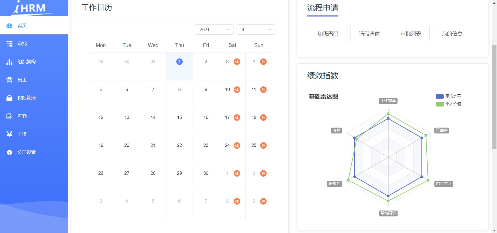
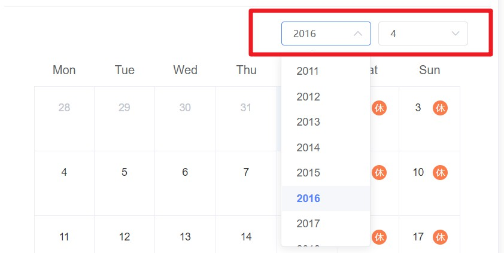
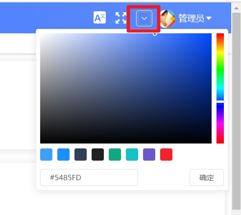
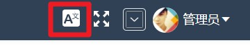
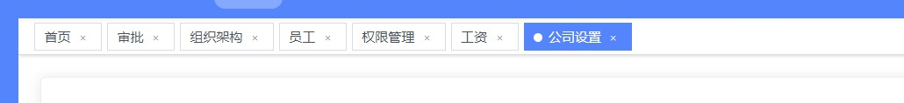

# day100

## 主页(审批 和 图表)



### 新建雷达图

> `src/views/dashboard/components/radar.vue`

- 下载[**echarts**](https://echarts.apache.org/zh/tutorial.html#5%20%E5%88%86%E9%92%9F%E4%B8%8A%E6%89%8B%20ECharts)图表

  ```bash
  $ yarn add echarts
  ```

- 使用[**基础雷达图**](https://echarts.apache.org/examples/zh/editor.html?c=radar)（定制结构数据）

  ```jsx
  <template>
    <!-- 雷达图  图表必须给高和宽度-->
    <div ref="myDiv" class="radar-echart" />
  </template>
  
  <script>
  // 完整加载过程
  // import * as echarts from 'echarts'
  // 按需加载
  import * as echarts from 'echarts/core' // 引入主模块
  import { RadarChart } from 'echarts/charts' // 引入雷达图
  // 引入提示框和标题组件
  import { TitleComponent, TooltipComponent, LegendComponent } from 'echarts/components'
  // 引入canvas渲染器
  import { CanvasRenderer } from 'echarts/renderers'
  // 注册必须的组件
  echarts.use(
    [TitleComponent, TooltipComponent, LegendComponent, RadarChart, CanvasRenderer]
  )
  
  export default {
    // 页面渲染完毕事件
    mounted() {
      const myChart = echarts.init(this.$refs.myDiv) // 得到图表实例
      myChart.setOption({
        title: {
          text: '基础雷达图'
        },
        tooltip: {},
        legend: {
          data: ['平均水平', '个人价值'],
          right: 20,
          orient: 'vertical'
        },
        radar: {
          // shape: 'circle',
          axisName: {
            color: '#fff',
            backgroundColor: '#999',
            borderRadius: 3,
            padding: [3, 5]
          },
          indicator: [
            { name: '工作效率', max: 100 },
            { name: '考勤', max: 100 },
            { name: '积极性', max: 100 },
            { name: '帮助同事', max: 100 },
            { name: '自主学习', max: 100 },
            { name: '正确率', max: 100 }
          ]
        },
        series: [{
          name: '平均 vs 个人',
          type: 'radar',
          // areaStyle: {normal: {}},
          data: [
            {
              value: [80, 80, 80, 80, 80, 80],
              name: '平均水平'
            },
            {
              value: [90, 75, 95, 90, 95, 90],
              name: '个人价值'
            }
          ]
        }]
      })
    }
  }
  </script>
  
  <style>
  .radar-echart {
      width: 500px;
      height: 400px;
  }
  </style>
  
  ```

### 新建工作日历

> `src/views/dashboard/components/work-calendar.vue`

- 选择框构建

  

  ```jsx
  <template>
    <div>
      <!-- 工作日历, 年和月 -->
      <div class="select-box">
        <el-select v-model="currentYear" size="small" style="width: 120px; margin-right: 10px">
          <!-- 年份取给定年份的, 前五年 + 后五年 -->
          <el-option v-for="item in yearList" :key="item" :label="item" :value="item" />
        </el-select>
        <el-select v-model="currentMonth" size="small" style="width: 120px;">
          <el-option v-for="item in 12" :key="item" :label="item" :value="item" />
        </el-select>
      </div>
    </div>
  </template>
  
  <script>
  export default {
    props: {
      startDate: {
        type: Date,
        default: () => {
          return new Date()
        }
      }
    },
    data() {
      return {
        currentYear: null, // 当前年份
        currentMonth: null, // 当前月份
        // yearList: [] // 要遍历的年的数组
      }
    },
    created() {
      this.currentYear = this.startDate.getFullYear() // 得到当前年份
      this.currentMonth = this.startDate.getMonth() + 1 // 当前月份
    }
  }
  </script>
  
  <style lang="scss" scoped>
  .select-box {
    display: flex;
    justify-content: flex-end;
  }
  </style>
  ```

- 动态计算`yearList`

  ```jsx
  computed: {
  // 要遍历的年的数组
    yearList() {
      return Array.from(new Array(11), (item, index) => index + this.currentYear - 5)
    }
  },
  ```

- 使用`element-ui`[**日历组件**](https://element.eleme.cn/#/zh-CN/component/calendar)

  ```jsx
  <template>
    <div>
      <!-- 工作日历, 年和月 -->
      <div class="select-box">
        <el-select v-model="currentYear" size="small" style="width: 120px; margin-right: 10px" @change="changeDate">
          <!-- 年份取给定年份的, 前五年 + 后五年 -->
          <el-option v-for="item in yearList" :key="item" :label="item" :value="item" />
        </el-select>
        <el-select v-model="currentMonth" size="small" style="width: 120px; margin-right: 10px" @change="changeDate">
          <el-option v-for="item in 12" :key="item" :label="item" :value="item" />
        </el-select></div>
      <el-calendar v-model="currentDate">
        <template #dateCell="{ date,data }">
          <div class="date-content">
            <span class="text">{{ data.day | getDay }}</span>
            <span v-if="isWeek(date)" class="rest">休</span>
          </div>
        </template>
      </el-calendar>
    </div>
  </template>
  
  <script>
  export default {
    name: 'WorkCalendar',
    // 过滤器去掉年月, 去掉 0
    filters: {
      getDay(value) {
        const day = value.split('-')[2] // 11, 02
        return day.startsWith('0') ? day.slice(1) : day
      }
    },
    props: {
      startDate: {
        type: Date,
        default: () => {
          return new Date()
        }
      }
    },
    data() {
      return {
        currentYear: null, // 当前年份
        currentMonth: null, // 当前月份
        currentDate: null
      }
    },
    computed: {
      // 要遍历的年的数组
      yearList() {
        return Array.from(new Array(11), (item, index) => index + this.currentYear - 5)
      }
    },
    // 解决日历同步
    watch: {
      currentDate(newValue) {
        this.currentYear = newValue.getFullYear()
        this.currentMonth = newValue.getMonth() + 1
      }
    },
    created() {
      this.currentYear = this.startDate.getFullYear() // 得到当前年份
      this.currentMonth = this.startDate.getMonth() + 1 // 当前月份
      this.changeDate()
    },
    methods: {
      changeDate() {
      // 生成新的日期
        this.currentDate = new Date(this.currentYear + '-' + this.currentMonth + '-1')
      },
      // 判断是否是周末
      isWeek(date) {
        return date.getDay() === 6 || date.getDay() === 0
      }
    }
  }
  </script>
  
  <style lang="scss" scoped>
  .select-box {
    display: flex;
    justify-content: flex-end;
  }
  
  ::v-deep .el-calendar-day {
    height:  auto;
  }
  ::v-deep .el-calendar-table__row td::v-deep .el-calendar-table tr td:first-child, ::v-deep .el-calendar-table__row td.prev{
    border: none;
  }
  .date-content {
    height: 40px;
    text-align: center;
    line-height: 40px;
    font-size: 14px;
  }
  .date-content .rest {
    color: #fff;
    border-radius: 50%;
    background: rgb(250, 124, 77);
    width: 20px;
    height: 20px;
    line-height: 20px;
    display: inline-block;
    font-size: 12px;
    margin-left: 10px;
  }
  .date-content .text{
    width: 20px;
    height: 20px;
    line-height: 20px;
    display: inline-block;
  
  }
  ::v-deep .el-calendar-table td.is-selected .text{
    background: #409eff;
    color: #fff;
    border-radius: 50%;
  }
  ::v-deep .el-calendar__header {
    display: none
  }
  </style>
  
  ```

- 主页布局`src/views/dashboard/index.vue`

  ```jsx
  <template>
    <div class="dashboard-container">
      <!-- 头部内容 -->
      <el-card class="header-card">
        <div>
          <div class="fl headL">
            <div class="headImg">
              
            </div>
            <div class="headInfoTip">
              <p class="firstChild">早安，{{ userInfo.username }}，祝你开心每一天！</p>
              <p class="lastChild">早安，{{ userInfo.username }} | {{ userInfo.departmentName }}</p>
            </div>
          </div>
          <div class="fr" />
        </div>
      </el-card>
      <!-- 主要内容 -->
      <el-row type="flex" justify="space-between">
        <!-- 左侧内容 -->
        <el-col :span="13" style="padding-right:26px">
          <!-- 工作日历 -->
          <el-card class="box-card">
            <div slot="header" class="header">
              <span>工作日历</span>
            </div>
            <!-- 放置日历组件 -->
            <work-calendar />
          </el-card>
          <!-- 公告 -->
          <el-card class="box-card">
            <div class="advContent">
              <div class="title"> 公告</div>
              <div class="contentItem">
                <ul class="noticeList">
                  <li>
                    <div class="item">
                      
                      <div>
                        <p><span class="col">朱继柳</span> 发布了 第1期“大讲堂”互动讨论获奖名单公布</p>
                        <p>2018-07-21 15:21:38</p>
                      </div>
                    </div>
                  </li>
                  <li>
                    <div class="item">
                      
                      <div>
                        <p><span class="col">朱继柳</span> 发布了 第2期“大讲堂”互动讨论获奖名单公布</p>
                        <p>2018-07-21 15:21:38</p>
                      </div>
                    </div>
                  </li>
                  <li>
                    <div class="item">
                      
                      <div>
                        <p><span class="col">朱继柳</span> 发布了 第3期“大讲堂”互动讨论获奖名单公布</p>
                        <p>2018-07-21 15:21:38</p>
                      </div>
                    </div>
                  </li>
                </ul>
              </div>
            </div>
          </el-card>
        </el-col>
        <!-- 右侧内容 -->
        <el-col :span="11">
          <el-card class="box-card">
            <div class="header headTit">
              <span>流程申请</span>
            </div>
            <div class="sideNav">
              <el-button class="sideBtn">加班离职</el-button>
              <el-button class="sideBtn">请假调休</el-button>
              <el-button class="sideBtn">审批列表</el-button>
              <el-button class="sideBtn">我的信息</el-button>
            </div>
          </el-card>
  
          <!-- 绩效指数 -->
          <el-card class="box-card">
            <div slot="header" class="header">
              <span>绩效指数</span>
            </div>
            <!-- 放置雷达图 -->
            <radar />
          </el-card>
          <!-- 帮助连接 -->
          <el-card class="box-card">
            <div class="header headTit">
              <span>帮助链接</span>
            </div>
            <div class="sideLink">
              <el-row>
                <el-col :span="8">
                  <a href="#">
                    <span class="icon iconGuide" />
                    <p>入门指南</p>
                  </a>
                </el-col>
                <el-col :span="8">
                  <a href="#">
                    <span class="icon iconHelp" />
                    <p>在线帮助手册</p>
                  </a>
                </el-col>
                <el-col :span="8">
                  <a href="#">
                    <span class="icon iconTechnology" />
                    <p>联系技术支持</p>
                  </a>
                </el-col>
              </el-row>
            </div>
          </el-card>
        </el-col>
      </el-row>
    </div>
  </template>
  
  <script>
  import { mapGetters, mapState } from 'vuex'
  import defaultImg from '@/assets/common/bigUserHeader.png'
  import workCalendar from './components/work-calendar.vue'
  import Radar from './components/radar.vue'
  
  export default {
    name: 'Dashboard',
    components: { workCalendar, Radar },
    data() {
      return {
        defaultImg
      }
    },
    computed: {
      ...mapGetters(['name']),
      ...mapState('user', ['userInfo'])
    }
  }
  </script>
  
  <style lang="scss" scoped>
  .dashboard-container {
    margin: 10px;
    li {
      list-style: none;
    }
    .headImg {
      float: left;
      width: 100px;
      height: 100px;
      border-radius: 50%;
      background: #999;
            img {
        width: 100%;
        height: 100%;
        border-radius: 50%;
      }
    }
  
    .headInfoTip {
      padding: 25px 0 0;
      margin-left: 120px;
      p {
        padding: 0 0 15px;
        margin: 0;
        &.firstChild {
          font-size: 24px;
        }
        &.lastChild {
          font-size: 20px;
          color: #7f8c8d;
        }
      }
    }
  }
  
  .box-card {
    padding: 5px 10px;
    margin-top: 20px;
    .header {
      span {
        color: #2c3e50;
        font-size: 24px;
      }
      .item {
        color: #97a8be;
        float: right;
        padding: 3px 0;
      }
    }
    .headTit {
      span {
        border-bottom: 4px solid #8a97f8;
        padding-bottom: 10px;
      }
    }
  }
  .header-card{
    position: relative;
    .header {
      position: absolute;
      right: 20px;
      top: 15px;
      z-index: 1;
    }
  }
  
  .advContent {
    background: #fff;
    border-radius: 5px 5px 0px 0px;
    .title {
      font-size: 16px;
      padding: 20px;
      font-weight: bold;
      border-bottom: solid 1px #ccc;
    }
    .contentItem {
      padding: 0 30px;
      min-height: 350px;
      .item {
        display: flex;
        padding:18px 0 10px;
        border-bottom: solid 1px #ccc;
        .col {
          color: #8a97f8;
        }
        img {
          width: 56px;
          height: 56px;
          border-radius: 50%;
          margin-right: 10px;
        }
        p{
          padding: 0 0 8px;
        }
      }
    }
  }
  .noticeList {
    margin: 0;
    padding: 0;
  }
  .sideNav,
  .sideLink {
    padding: 30px 0 12px;
    .sideBtn {
      padding: 16px 26px;
      font-size:16px;
      margin: 10px 5px;
    }
  }
  .sideLink {
    text-align: center;
    .icon {
      display: inline-block;
      width: 76px;
      height: 76px;
      background: url('./../../assets/common/icon.png') no-repeat;
    }
    .iconGuide {
      background-position: 0 0;
    }
    .iconHelp {
      background-position: -224px 0;
    }
    .iconTechnology {
      background-position: -460px 0;
    }
  }
  </style>
  ```

## 小功能

### 全屏

- 安装插件

  ```bash
  $ yarn add screenfull
  ```

- 封装全屏显示的组件 `src/components/ScreenFull/index.vue`

  ```jsx
  <template>
    <!-- 放置一个图标 -->
    <div>
      <!-- svg-icon组件, 配置icon-class属性, 配置成svg的文件名即可 -->
      <svg-icon
        v-if="!isFullScreen"
        icon-class="fullscreen"
        class="fullscreen"
        @click="toggleFullScreen"
      />
      <svg-icon
        v-else
        icon-class="exit-fullscreen"
        class="fullscreen"
        @click="toggleFullScreen"
      />
    </div>
  </template>
  
  <script>
  import ScreenFull from 'screenfull'
  export default {
    name: 'ScreenFull',
    data() {
      return {
        isFullScreen: false // 默认不全屏
      }
    },
    methods: {
      toggleFullScreen() {
        // 查看是否支持全屏
        if (ScreenFull.isEnabled) {
          // 支持
          ScreenFull.toggle()
          this.isFullScreen = !this.isFullScreen
        } else {
          // 不支持
          this.$message.error('兄弟, 您的浏览器版本过低, 不支持全屏功能哦!')
        }
      }
    }
  }
  </script>
  
  <style lang="scss" scoped>
  .fullscreen {
    width: 20px;
    height: 20px;
    fill: #fff!important;
    cursor: pointer;
  }
  </style>
  
  ```

- 注册组件`src/components/index.js`

  ```jsx
  import ScreenFull from './ScreenFull'
  
  const componentsPoll = [
    ...
    ScreenFull
  ]
  ```

- 使用组件`layout/navbar.vue`

  ```jsx
  <div class="right-menu">
    <!-- 全屏组件 -->
    <screen-full class="right-menu-item" />
    ...
  </div>
  
  .right-menu-item {
    vertical-align: middle;
  }
  ```

### 动态主题的设置 



- 使用 ThemePicker 组件`src/components/ThemePicker/index.vue`

  ```jsx
  <template>
    <el-color-picker
      v-model="theme"
      :predefine="['#409EFF', '#1890ff', '#304156','#212121','#11a983', '#13c2c2', '#6959CD', '#f5222d', ]"
      class="theme-picker"
      popper-class="theme-picker-dropdown"
    />
  
  </template>
  
  <script>
  const version = require('element-ui/package.json').version // element-ui version from node_modules
  const ORIGINAL_THEME = '#409EFF' // default color
  export default {
    name: 'ThemePicker',
    data() {
      return {
        chalk: '', // content of theme-chalk css
        theme: ''
      }
    },
    computed: {
      defaultTheme() {
        return this.$store.state.settings.theme
      }
    },
    watch: {
      defaultTheme: {
        handler: function(val, oldVal) {
          this.theme = val
        },
        immediate: true
      },
      /* async theme(val) {
  
      } */
      // 进入页面立刻执行
      theme: {
        immediate: true,
        async handler(val) {
          const oldVal = this.chalk ? this.theme : ORIGINAL_THEME
          if (typeof val !== 'string') return
          const themeCluster = this.getThemeCluster(val.replace('#', ''))
          const originalCluster = this.getThemeCluster(oldVal.replace('#', ''))
          // console.log(themeCluster, originalCluster)
          const $message = this.$message({
            message: '  Compiling the theme',
            customClass: 'theme-message',
            type: 'success',
            duration: 0,
            iconClass: 'el-icon-loading'
          })
          const getHandler = (variable, id) => {
            return () => {
              const originalCluster = this.getThemeCluster(ORIGINAL_THEME.replace('#', ''))
              const newStyle = this.updateStyle(this[variable], originalCluster, themeCluster)
              let styleTag = document.getElementById(id)
              if (!styleTag) {
                styleTag = document.createElement('style')
                styleTag.setAttribute('id', id)
                document.head.appendChild(styleTag)
              }
              styleTag.innerText = newStyle
            }
          }
          if (!this.chalk) {
            const url = `https://unpkg.com/element-ui@${version}/lib/theme-chalk/index.css`
            await this.getCSSString(url, 'chalk')
          }
          const chalkHandler = getHandler('chalk', 'chalk-style')
          chalkHandler()
          const styles = [].slice.call(document.querySelectorAll('style'))
            .filter(style => {
              const text = style.innerText
              return new RegExp(oldVal, 'i').test(text) && !/Chalk Variables/.test(text)
            })
          styles.forEach(style => {
            const { innerText } = style
            if (typeof innerText !== 'string') return
            style.innerText = this.updateStyle(innerText, originalCluster, themeCluster)
          })
          this.$emit('change', val)
          $message.close()
        }
      }
    },
    methods: {
      updateStyle(style, oldCluster, newCluster) {
        let newStyle = style
        oldCluster.forEach((color, index) => {
          newStyle = newStyle.replace(new RegExp(color, 'ig'), newCluster[index])
        })
        return newStyle
      },
      getCSSString(url, variable) {
        return new Promise(resolve => {
          const xhr = new XMLHttpRequest()
          xhr.onreadystatechange = () => {
            if (xhr.readyState === 4 && xhr.status === 200) {
              this[variable] = xhr.responseText.replace(/@font-face{[^}]+}/, '')
              resolve()
            }
          }
          xhr.open('GET', url)
          xhr.send()
        })
      },
      getThemeCluster(theme) {
        const tintColor = (color, tint) => {
          let red = parseInt(color.slice(0, 2), 16)
          let green = parseInt(color.slice(2, 4), 16)
          let blue = parseInt(color.slice(4, 6), 16)
          if (tint === 0) { // when primary color is in its rgb space
            return [red, green, blue].join(',')
          } else {
            red += Math.round(tint * (255 - red))
            green += Math.round(tint * (255 - green))
            blue += Math.round(tint * (255 - blue))
            red = red.toString(16)
            green = green.toString(16)
            blue = blue.toString(16)
            return `#${red}${green}${blue}`
          }
        }
        const shadeColor = (color, shade) => {
          let red = parseInt(color.slice(0, 2), 16)
          let green = parseInt(color.slice(2, 4), 16)
          let blue = parseInt(color.slice(4, 6), 16)
          red = Math.round((1 - shade) * red)
          green = Math.round((1 - shade) * green)
          blue = Math.round((1 - shade) * blue)
          red = red.toString(16)
          green = green.toString(16)
          blue = blue.toString(16)
          return `#${red}${green}${blue}`
        }
        const clusters = [theme]
        for (let i = 0; i <= 9; i++) {
          clusters.push(tintColor(theme, Number((i / 10).toFixed(2))))
        }
        clusters.push(shadeColor(theme, 0.1))
        return clusters
      }
    }
  }
  </script>
  
  <style>
  .theme-message,
  .theme-picker-dropdown {
    z-index: 99999 !important;
  }
  .theme-picker .el-color-picker__trigger {
    height: 26px !important;
    width: 26px !important;
    padding: 2px;
  }
  .theme-picker-dropdown .el-color-dropdown__link-btn {
    display: none;
  }
  .el-color-picker {
    height: auto !important;
  }
  </style>
  
  ```

- 注册`src/components/index.js`

  ```jsx
  import ThemePicker from './ThemePicker'
  
  const componentsPoll = [
    ...
    ThemePicker
  ]
  ```

- 置于`layout/navbar.vue`

  ```jsx
  <div class="right-menu">
    <!-- 全屏组件 -->
    <screen-full class="right-menu-item" />
    <!-- 放置换肤插件 -->
    <theme-picker class="right-menu-item" style="padding-top: 4px" @change="changeTheme" />
  </div>
  ```

- 将颜色同步到vuex中, 实现持久化

  ```jsx
  changeTheme(val) {
    // 发布action, 同步主题色到vuex中
    this.$store.dispatch('settings/changeSetting', {
      key: 'theme',
      value: val
    })
  }
  ```

  ```js
  /* src/store/modules/settings.js */
  
  import defaultSettings from '@/settings'
  import Cookies from 'js-cookie'
  const { showSettings, fixedHeader, sidebarLogo } = defaultSettings
  const themeKey = 'theme_token'
  const themeDefaultColor = '#5485fd'
  
  const state = {
    showSettings: showSettings,
    fixedHeader: fixedHeader,
    sidebarLogo: sidebarLogo,
    theme: Cookies.get(themeKey) || themeDefaultColor
  }
  
  const mutations = {
    CHANGE_SETTING: (state, { key, value }) => {
      // eslint-disable-next-line no-prototype-builtins
      if (state.hasOwnProperty(key)) {
        state[key] = value
      }
      if (key === 'theme') {
        Cookies.set(themeKey, value)
      }
    },
    resetTheme(state) {
      // 重置成默认颜色
      state.theme = themeDefaultColor
      // cookies中也要移出
      Cookies.remove(themeKey)
    }
  }
  
  const actions = {
    changeSetting({ commit }, data) {
      commit('CHANGE_SETTING', data)
    }
  }
  
  export default {
    namespaced: true,
    state,
    mutations,
    actions
  }
  ```

- `src/store/modules/user.js`退出的action操作

  ```jsx
  logout(context) {
    context.commit('removeUserInfo')
    context.commit('removeToken')
    resetRouter()
    context.commit('permission/setRoutes', [], { root: true })
    context.commit('settings/resetTheme', null, { root: true })
  }
  ```

### 自定义效果定制

- `src/layout/components/Navbar.vue`

  ```jsx
  <div class="navbar" :style="{ background: $store.state.settings.theme }">
  ```

- `src/layout/components/Sidebar/index.vue`

  ```jsx
  <div :class="{'has-logo':showLogo}" :style="{ background: $store.state.settings.theme }">
  ```

- `src\App.vue`通过类名切换主题

  ```jsx
  <template>
    <div id="app" :class="style">
      <router-view />
    </div>
  </template>
  
  <script>
  export default {
    name: 'App',
    computed: {
      style() {
        let themeClassName = ''
        switch (this.$store.state.settings.theme) {
          case '#409EFF':
            themeClassName = 'skyblue-theme'
            break
          case '#1890FF':
            themeClassName = 'deepblue-theme'
            break
          case '#304156':
            themeClassName = 'molv-theme'
            break
          default:
            themeClassName = 'default-theme'
        }
        return {
          [themeClassName]: true
        }
      }
    }
  }
  </script>
  ```

- 新建主题`src/styles/theme.scss`，`src/styles/index.scss`引入

### [多语言实现](http://kazupon.github.io/vue-i18n/zh/introduction.html)

- 安装国际化包

  ```bash
   $ yarn add vue-i18n
  ```

-  新建`src/lang/index.js`导入语言包(**对应语言根据模块翻译得到**)

  ```js
  import Vue from 'vue' // 引入Vue
  import VueI18n from 'vue-i18n' // 引入国际化的插件包
  import Cookies from 'js-cookie' // 引入cookie包
  import elementEN from 'element-ui/lib/locale/lang/en' // 引入饿了么的英文包
  import elementZH from 'element-ui/lib/locale/lang/zh-CN' // 引入饿了么的中文包
  import customZH from './zh' // 引入自定义中文包
  import customEN from './en' // 引入自定义英文包
  Vue.use(VueI18n) // 全局注册国际化包
  
  // 创建国际化插件的实例
  export default new VueI18n({
    // 指定语言类型
    locale: Cookies.get('language') || 'en', // 从cookie中获取语言类型 获取不到就是中文
  
    // 配置的可供切换的语言列表
    messages: {
      // english 英文
      en: {
        ...elementEN, // 将饿了么的英文语言包引入
        ...customEN
      },
      // zhong 中文
      zh: {
        ...elementZH, // 将饿了么的中文语言包引入
        ...customZH
      }
    }
  })
  ```

- 挂载插件`src/main.js`

  ```js
  import i18n from '@/lang'
  
  // 配置ElementUI的中英切换逻辑
  Vue.use(ElementUI, {
    i18n: (key, value) => i18n.t(key, value)
  })
  
  new Vue({
    el: '#app',
    router,
    store,
    i18n,
    render: h => h(App)
  })
  ```

- 结构修改

  ```jsx
  // src/layout/components/Navbar.vue
  <div class="app-breadcrumb">
    {{ $t('navbar.title') }}
    <span class="breadBtn">{{ $t('navbar.titleBtn') }}</span>
  </div>
  ```

  ```jsx
  // src/layout/components/Sidebar/SidebarItem.vue
  
  <item :icon="onlyOneChild.meta.icon||(item.meta&&item.meta.icon)" :title="$t(`route.${onlyOneChild.name}`)" />
  ```

#### 封装多语言组件 - 切换语言



-   新建`src/components/Lang/index.vue`

  ```jsx
  <template>
    <el-dropdown trigger="click" @command="changeLanguage">
      <div>
        <svg-icon style="color:#fff;font-size:20px" icon-class="language" />
      </div>
      <el-dropdown-menu slot="dropdown">
        <el-dropdown-item command="zh" :disabled="'zh'=== $i18n.locale ">中文</el-dropdown-item>
        <el-dropdown-item command="en" :disabled="'en'=== $i18n.locale ">en</el-dropdown-item>
      </el-dropdown-menu>
    </el-dropdown>
  </template>
  
  <script>
  import Cookies from 'js-cookie'
  export default {
    name: 'Lang',
    methods: {
      changeLanguage(lang) {
        Cookies.set('language', lang) // 切换多语言
        this.$i18n.locale = lang // 设置给本地的i18n插件
        this.$message.success('切换多语言成功')
      }
    }
  }
  
  </script>
  ```

- 注册`src/components/index.js`

  ```js
  import Lang from './Lang'
  
  const componentsPoll = [
    ...
    Lang
  ]
  ```

- 使用组件`src/layout/components/Navbar.vue`

  ```jsx
  <!-- 语言包 -->
  <lang class="right-menu-item" />
  <!-- 全屏组件 -->
  <screen-full class="right-menu-item" />
  <!-- 放置换肤插件 -->
  <theme-picker class="right-menu-item" style="padding-top: 4px" @change="changeTheme" />
  ```

### [tab页的视图引入](https://panjiachen.gitee.io/vue-element-admin/#/dashboard)



- 构建组件`src/components/TagsView`

- `src/components/index.js`注册组件

  ```js
  import TagsView from './TagsView'
  
  const componentsPoll = [
    ...
    TagsView
  ]
  ```

- `src/store/modules/tagsView.js`构建module

- 导入`src/store/index.js`

  ```js
  import tagsView from './modules/tagsView'
  
  const store = new Vuex.Store({
    modules: {
      app,
      settings,
      user,
      permission,
      tagsView
    },
    getters
  })
  ```

- `src/layout/Index.vue`引入组件

  ```jsx
  <template>
    <div :class="classObj" class="app-wrapper">
      <!-- 这句可以忽略, 兼容移动设备的 -->
      <div v-if="device==='mobile'&&sidebar.opened" class="drawer-bg" @click="handleClickOutside" />
      <!-- 左边的侧边栏 -->
      <sidebar class="sidebar-container" />
  
      <!-- 右侧的主体 -->
      <div class="main-container">
        <!-- 右侧头部导航 -->
        <div :class="{'fixed-header':fixedHeader}">
          <navbar />
          <!-- 放置tags-view -->
          <tags-view />
        </div>
        <!-- 右侧下面的主体内容 -->
        <app-main />
      </div>
    </div>
  </template>
  ```

- 添加缓存控制 `layout/components/AppMain.vue`

  ```jsx
  <template>
    <section class="app-main">
      <transition name="fade-transform" mode="out-in">
        <!-- keep-alive 只要包裹了, 就会缓存, 所有的都缓存 -->
        <!-- :include 表示要对 哪些组件 做缓存 -->
        <!-- cachedViews: [组件1的name, 组件2的name] -->
        <keep-alive :include="cachedViews">
          <router-view :key="key" />
        </keep-alive>
      </transition>
    </section>
  </template>
  
  <script>
  export default {
    name: 'AppMain',
    computed: {
      cachedViews() {
        return this.$store.state.tagsView.cachedViews.map(item => {
          // 让首字母大写
          return item[0].toUpperCase() + item.slice(1)
        })
      },
      key() {
        return this.$route.path
      }
    }
  }
  </script>
  
  <style scoped>
  .app-main {
    /*50 = navbar  */
    min-height: calc(100vh - 50px);
    width: 100%;
    position: relative;
    overflow: hidden;
  }
  .fixed-header+.app-main {
    padding-top: 50px;
  }
  </style>
  
  <style lang="scss">
  // fix css style bug in open el-dialog
  .el-popup-parent--hidden {
    .fixed-header {
      padding-right: 15px;
    }
  }
  </style>
  
  ```

  

  ### 終...

