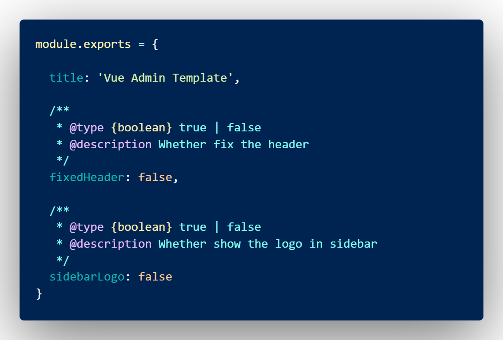

# day88

## HRSAAS(后台人资管理项目)


### 项目模板

- github

  ```bash
  $ git clone  https://github.com/PanJiaChen/vue-admin-template.git  hrsaas #拉取基础模板到hrsaas目录 (github)
  ```

- gitee

  ```bash
  $ git clone git@gitee.com:panjiachen/vue-admin-template.git hrsaas # 拉取基础模板的代码  (码云)
  ```

- 安装依赖、项目启动

  - npm

    ```bash
    $ npm i
    ```

    ```bash
    $ npm run dev
    ```

  - yarn

    ```bash
    $ yarn
    ```

    ```bash
    $ yarn dev
    ```

  

### 目录结构

```bash
├── build                      # 构建打包相关
├── mock                       # 项目mock 模拟数据
├── public                     # 静态资源
│   │── favicon.ico            # favicon图标
│   └── index.html             # html模板
├── src                        # 源代码
│   ├── api                    # 所有请求
│   ├── assets                 # 主题 字体等静态资源
│   ├── components             # 全局公用组件
│   ├── icons                  # 项目所有 svg icons
│   ├── layout                 # 全局 layout
│   ├── router                 # 路由
│   ├── store                  # 全局 store管理
│   ├── styles                 # 全局样式
│   ├── utils                  # 全局公用方法
│   ├── vendor                 # 公用vendor
│   ├── views                  # views 所有页面
│   ├── App.vue                # 入口页面
│   ├── main.js                # 入口文件 加载组件 初始化等
│   └── permission.js          # 权限管理
│   └── settings.js            # 配置文件
├── tests                      # 测试
├── .env.xxx                   # 环境变量配置
├── .eslintrc.js               # eslint 配置项
├── .babelrc                   # babel-loader 配置
├── .travis.yml                # 自动化CI配置
├── vue.config.js              # vue-cli 配置
├── postcss.config.js          # postcss 配置
└── package.json               # package.json
```

### 结构梳理

#### main.js

> 删除**`mock`**文件夹 --- 使用线上接口
>
> 删除**`vue.config.js`**中 **devServer** 中配的 `before: require('./mock/mock-server.js')`（约 39 行）


#### APP.vue


#### permission.js

> 控制页面登录权限(**路由访问**)的文件


#### setting.js

> 对于一些项目信息的配置，里面有三个属性
>
>  `title` （项目名称）
>
> `fixedHeader`（固定头部）
>
> `sidebarLogo`（显示左侧菜单logo）



#### Vuex

> app.js模块和settings.js模块，功能已经完备，不需要再进行修改
>
> user.js里面的内容删除，并且导出一个默认配置
>
> ```js
> export default  {
>   namespaced: true,
>   state: {},
>   mutations: {},
>   actions: {}
> }
> ```
>
> 同时，由于getters中引用了user中的状态，修改文件内容
>
> ```js
> const getters = {
>   sidebar: state => state.app.sidebar,
>   device: state => state.app.device
> }
> export default getters
> ```


#### scss

> 使用了[**scss**](https://www.sass.hk/)作为css的扩展语言，在**`styles`**目录下存在`scss`的相关文件


#### icons


#### Axios

> 修改`src/utils/request.js`
>
> ```js
> import axios from 'axios'
> 
> // 创建一个axios的实例
> const service = axios.create({
>   baseURL: process.env.VUE_APP_BASE_API, // url = base url + request url
>   timeout: 5000 // request timeout
> })
> 
> export default service // 导出axios实例
> ```
>
> 


#### api

> 修改文件`src/api/user.js`


#### 公共资源图片和公共样式

> 准备图片资料`common`文件夹
>
> 修改`variables.scss`
>
> - 添加了一些基础的变量值
>
> 新增`common.scss`
>
> 在**`index.scss`**中引入该样式
>
> ```js
> @import './common.scss'; //引入common.scss样式表
> ```


