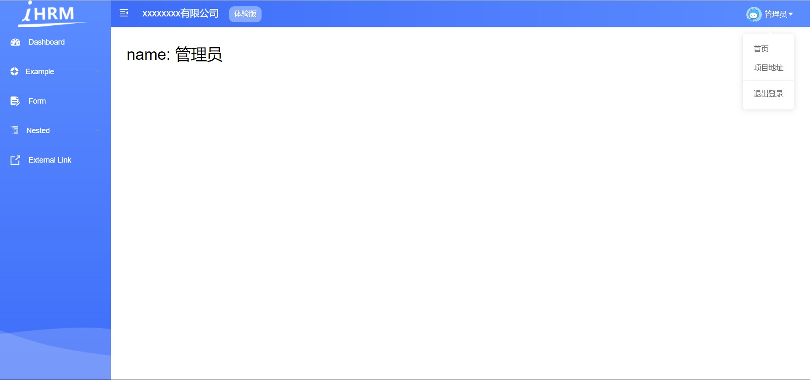

# day90

## 遗留的小bug

```js
/* src/utils/request.js */
service.interceptors.response.use(value => {
  const res = value.data // 响应拦截时 返回value.data
  ...
  return res
}, reason => {
  ...
})

/* 在数据处理时确定data套了几层 */
/* src/store/modules/user.js */
const actions = {
  login(context, data) {
    return new Promise((resolve, reject) => {
      reqLogin(data).then(value => {
        const newToken = value.data
        ...
      }).catch(error => {
        ...
      })
    })
  }
}
```

## 主页模块 -- 之一

### 主页的token登录拦截处理

> 根据token处理主页的访问权限问题 （没有token的用户, 不允许进入系统）


- `src/permission.js`

  ```js
  // 路由前置守卫
  import router from '@/router'
  import store from '@/store'
  
  const whiteList = ['/login', '/404'] // 定义白名单  所有不受权限控制的页面
  
  // 导航前置守卫
  router.beforeEach((to, from, next) => {
    const token = store.getters.token
    // 判断有无token
    if (token) {
      // 判断是不是去登录页
      if (to.path === '/login') {
        next('/') // 引导到首页
      } else {
        next() // 放行
      }
    } else {
      // 看在不在白名单中(免登陆即可访问的页面)
      if (whiteList.includes(to.path)) {
        next()
      } else {
        next('/login')
      }
    }
  })
  ```

#### 添加`进度条`效果 (优化体验)

- [**NProgress.js**](https://ricostacruz.com/nprogress/)

  ```js
  // 路由前置守卫
  import router from '@/router'
  import store from '@/store'
  import NProgress from 'nprogress' // 引入一份进度条插件
  import 'nprogress/nprogress.css' // 引入进度条样式
  
  const whiteList = ['/login', '/404'] // 定义白名单  所有不受权限控制的页面
  
  // 导航前置守卫
  router.beforeEach((to, from, next) => {
    NProgress.start()
    const token = store.getters.token
    // 判断有无token
    if (token) {
      // 判断是不是去登录页
      if (to.path === '/login') {
        next('/') // 跳到首页, 被next拦截走的, 不会自动关闭, 因为没有进入到 afterEach, 需要手动关闭
        NProgress.done()
      } else {
        next() // 放行
      }
    } else {
      // 看在不在白名单中(免登陆即可访问的页面)
      if (whiteList.includes(to.path)) {
        next()
      } else {
        next('/login')
        NProgress.done()
      }
    }
  })
  
  router.afterEach((to, from) => {
    NProgress.done()
  })
  ```

## 主页布局架构


### Sidebar (侧边栏)

- 侧边栏样式

  ```scss
  /* styles/siderbar.scss */
  // 设置背景渐变色
  .sidebar-container {
     background: linear-gradient(bottom, #3d6df8, #5b8cff);
  }
  // 左侧导航背景图片
  .scrollbar-wrapper { 
     background: url('~@/assets/common/leftnavBg.png') no-repeat 0 100%;
  }
  // 菜单选中颜色
  .el-menu {
    border: none;
    height: 100%;
    width: 100% !important;
    a{
      li{
        .svg-icon{
          color: #fff;
          font-size: 18px;
          vertical-align: middle;
          .icon{
            color:#fff;
          }
        }
        span{
          color: #fff;
        }
        &:hover{
          .svg-icon{
            color: #43a7fe
          }
          span{
            color: #43a7fe;
          }
        }
      }
    }
  }
  ```

- 左侧logo图片`src/setttings.js`

  ```js
  module.exports = {
  
    title: '人力资源管理平台',
  
    /**
     * @type {boolean} true | false
     * @description Whether fix the header
     */
    fixedHeader: false,
  
    /**
     * @type {boolean} true | false
     * @description Whether show the logo in sidebar
     */
    sidebarLogo: true // 显示logo
  }
  ```

- 设置头部图片结构、样式 `src/layout/components/Sidebar/Logo.vue`

  ```jsx
  <div class="sidebar-logo-container" :class="{'collapse':collapse}">
      <transition name="sidebarLogoFade">
  
          <router-link key="collapse" class="sidebar-logo-link" to="/">
              
          </router-link>
              
      </transition>
  </div>
      
  <style lang="scss" scoped>
  ...
  
  .sidebar-logo-container {
    ... 
    // 去除logo的背景色
    // background: #2b2f3a;
    ...
  
    & .sidebar-logo-link {
      ...
  
      & .sidebar-logo {
        width: 140px;
        vertical-align: middle;
        margin-right: 12px;
      }
  	// 大图样式
      ...
    }
  
    &.collapse {
      .sidebar-logo {
        margin-right: 0px;
        width: 50px;
        height: 24px;
      }
    }
    // 小图样式
  }
  </style>
  ```

### NavBar (头部内容)`layout/components/Navbar.vue`

- 结构调整 

  ```jsx
  <template>
    <div class="navbar">
      <hamburger :is-active="sidebar.opened" class="hamburger-container" @toggleClick="toggleSideBar" />
      <div class="app-breadcrumb">
        xxxxxxxx有限公司
        <span class="breadBtn">体验版</span>
      </div>
      <!-- <breadcrumb class="breadcrumb-container" /> -->
  
      <div class="right-menu">
        <el-dropdown class="avatar-container" trigger="click">
          <div class="avatar-wrapper">
            
            <span class="name">管理员</span>
            <i class="el-icon-caret-bottom" style="color:#fff" />
          </div>
          <el-dropdown-menu slot="dropdown" class="user-dropdown">
            <router-link to="/">
              <el-dropdown-item>
                首页
              </el-dropdown-item>
            </router-link>
            <a target="_blank" href="https://xxx.com">
              <el-dropdown-item>项目地址</el-dropdown-item>
            </a>
            <el-dropdown-item divided @click.native="logout">
              <span style="display:block;">退出登录</span>
            </el-dropdown-item>
          </el-dropdown-menu>
        </el-dropdown>
      </div>
    </div>
  </template>
  ```

- 样式调整

  ```scss
  <style lang="scss" scoped>
  .app-breadcrumb{
    display: inline;
    font-size: 18px;
    line-height: 50px;
    margin-left: 10px;
    color: #fff;
    cursor: text;
    .breadBtn{
      background: #84a9fe;
      font-size: 14px;
      padding: 0 10px;
      display: inline-block;
      height: 30px;
      line-height: 30px;
      border-radius: 10px;
      margin-left: 15px;
    }
  }
  .navbar {
    ...
    background: linear-gradient(left, #3d6df8, #5b8cff);
    ...
  
    ...
  
      .avatar-container {
        ...
  
        .avatar-wrapper {
          position: relative;
          .user-avatar{
            cursor: pointer;
            width: 30px;
            height: 30px;
            border-radius: 15px;
            vertical-align: middle;
          }
          .name{
            cursor: pointer;
            color: #fff;
            vertical-align: middle;
            margin-left: 5px;
          }
          .user-dropdown{
            color: #fff;
          }
          .el-icon-creat-bottom{
            cursor: pointer;
            position: absolute;
            right: -20px;
            top: 20px;
            font-size: 12px;
          }
        }
      }
    }
  }
  </style>
  ```

- 汉堡组件图标颜色  `src/components/Hamburger/index.vue`

  ```jsx
  <svg
       :class="{'is-active':isActive}"
       class="hamburger"
       viewBox="0 0 1024 1024"
       xmlns="http://www.w3.org/2000/svg"
       width="64"
       height="64"
       fill="#fff" 
   >
  ```

**预期效果**



## 获取用户资料接口

- 在**`src/api/user.js`**中封装获取用户资料的方法

  ```js
  /**
   * 获取用户的基本资料
   ***/
  export function reqGetInfo(token) {
    return request({
      method: 'post',
      url: '/sys/profile'
    })
  }
  ```

- 需要配置 headers 请求头, 配置 token, 在请求任何带安全权限的接口时都需要**`令牌(token)`** 

  

- 统一添加token `src/utils/request.js`

  ```js
  // 请求拦截器
  instance.interceptors.request.use(function(config) {
    // 在发送请求之前做些什么
    if (store.getters.token) {
      // 如果token存在 注入token
      config.headers.Authorization = `Bearer ${store.getters.token}`
    }
    return config
  }, function(error) {
    // 对请求错误做些什么
    return Promise.reject(error)
  })
  ```

## vuex存储用户资料

> 用户状态会在后续的开发中，频繁用到

- `src/store/modules/user.js`

  ```js
  import { reqGetInfo, reqLogin } from '@/api/user'
  ...
  const state = {
    ...,
    userInfo: {}
  }
  
  const mutations = {
    ...,
    setUserInfo(state, newUserInfo) {
      state.userInfo = newUserInfo
    },
    removeUserInfo(state) {
      state.userInfo = {}
    }
  }
  
  const actions = {
    ...,
    async getUserInfo(context) {
      const res = await reqGetInfo()
      context.commit('setUserInfo', res.data)
      return res.data // return一下结果, 方便获取用户资料
    }
  }
  ```

- 可在`navBar` 组件中调用测试

  ```jsx
  import { mapActions } from 'vuex'
  
  created() {
    this.getUserInfo()
  },
  methods: {
    ...mapActions('user', ['getUserInfo']),
  }
  ```

- 建立用户名的映射`src/store/getters.js`

  ```js
  const getters = {
    sidebar: state => state.app.sidebar,
    device: state => state.app.device,
    token: state => state.user.token,
    name: state => state.user.userInfo.username
  }
  export default getters
  ```

- `src/layout/components/Navbar.vue`使用

  ```jsx
  import { mapGetters, mapActions } from 'vuex'
  
  computed: {
    ...mapGetters([
      'sidebar',
      'avatar',
      'name'
    ])
  },
  ```

## 导航守卫处获取个人资料(预处理）

> `对于不同的用户角色, 将来需要有不同的菜单展示的`, **应该在一准备要进入到页面, 就获取用户信息**, 要等用户信息获取完了, 再让你完全进页面

`src\permission.js`

```js
// 导航前置守卫
router.beforeEach(async(to, from, next) => {
  NProgress.start()
  const token = store.getters.token
  // 判断有无token
  if (token) {
    // 判断是不是去登录页
    if (to.path === '/login') {
      next('/') // 跳到首页 (这是就是一个小的重定向, 如果访问有token访问login, 就拦截到首页)
      NProgress.done()
    } else {
      // 正常放行, 正常访问首页等内部页面, 需要获取用户信息
      // 如果当前vuex中已经有用户资料了, 就不需要再获取了 (没必要重复获取资料)
      if (!store.state.user.userInfo.userId) {
        // 没有id表示当前用户资料没有获取过, 就获取一下次
        const res = await store.dispatch('user/getUserInfo')
        console.log('将来权限控制', res)
      }
      next()
    }
  } else {
    // 看在不在白名单中(免登陆即可访问的页面)
    if (whiteList.includes(to.path)) {
      next()
    } else {
      next('/login')
      NProgress.done()
    }
  }
})
```


