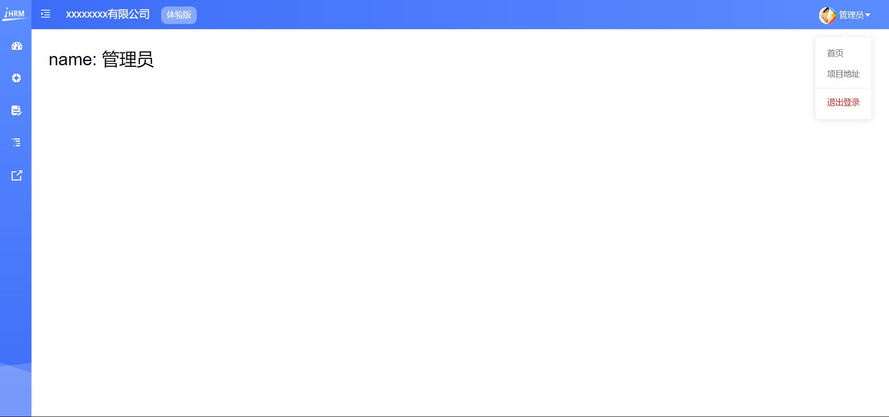

# day91

## 主页之二

### 获取头像接口合并数据

- 封装获取用户信息接口  `src/api/user.js`

  ```js
  export function reqGetUserDetailById(id) {
    return request({
      method: 'GET',
      url: `/sys/user/${id}`
    })
  }
  ```

- `src/store/modules/user.js`获取头像存入`vuex`

  ```js
  import { reqGetInfo, reqLogin, reqGetUserDetailById } from '@/api/user'
  
  const actions = {
    async getUserInfo(context) {
      // 请求获取id
      const { data: res } = await reqGetInfo()
      // 通过id获取user详细信息
      const { data: res2 } = await reqGetUserDetailById(res.userId)
      const baseResult = {
        // 展开所有项作为新对象存储
        ...res,
        ...res2
      }
      console.log(baseResult)
      context.commit('setUserInfo', baseResult)
      return baseResult
    }
  }
  ```

- `src/store/getters.js`

  ```js
  staffPhoto: state => state.user.userInfo.staffPhoto
  ```

### 根据数据替换实际用户名和头像

- `layout/components/Navbar.vue`

  ```jsx
  
  <span class="name">{{ name }}</span>
  
  computed: {
    ...mapGetters([
      'sidebar',
      'avatar',
      'name',
      'staffPhoto'
    ])
  },
  ```

- 处理失效图片带来的影响

  

### 自定义指令-处理图片加载失败

- 新建  `src/directives/index.js`

  ```js
  export const imgerror = {
    // el 指令所在的元素
    // binding 指令的相关信息对象, binding.value 指令的值
    inserted(el, binding) {
      // console.log(el, bindings)
      el.onerror = function() {
        // console.log('图片加载失败了'), 设置备用图片地址
        el.src = binding.value
      }
    }
  }
  
  // v-color="字体颜色"
  export const color = {
    inserted(el, binding) {
      el.style.color = binding.value
    }
  }
  ```

- `main.js`按需导入

  ```js
  import { imgerror, color } from '@/directives'
  
  Vue.directive('imgerror', imgerror)
  Vue.directive('color', color)
  ```

- `layout/components/Navbar.vue`使用

  ```jsx
  
  <span class="name">{{ name }}</span>
      
  <span v-color="'red'" style="display:block;">退出登录</span>
  
      
  <script> 
  // 使用静态资源图片需要引入使用
  import Img from '@/assets/common/head.jpg'    
  data() {
    return {
      defaultImg: Img
    }
  },
  </script> 
  ```

### 实现退出功能


-  `src/store/modules/user.js`

  ```js
  import { reqGetInfo, reqLogin, reqGetUserDetailById } from '@/api/user'
  import { getToken, removeToken, setToken } from '@/utils/auth'
  const state = {
    token: getToken() || null,
    userInfo: {}
  }
  
  const mutations = {
    ...
    removeUserInfo(state) {
      state.userInfo = {}
    },
    removeToken(state) {
      state.token = null
      removeToken()
    }
  }
  
  const actions = {
    ...
    logout(context) {
      context.commit('removeToken')
      context.commit('removeUserInfo')
    }
  }
  ```

### Token失效的处理


-   `src/utils/request.js`

  ```js
  service.interceptors.response.use(value => {
    ...
  }, reason => {
    console.dir(reason)
    if (reason.response.status === 401 && reason.response.data.code === 10002) {
      Message.error('登录会话过期，请重新登录')
      store.dispatch('user/logout')
      router.push('/')
    } else {
      Message.error(reason.message)
    }
    return Promise.reject(reason)
  })
  ```



