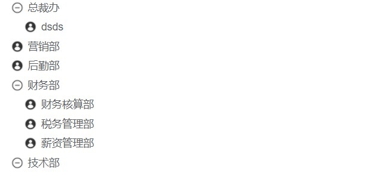
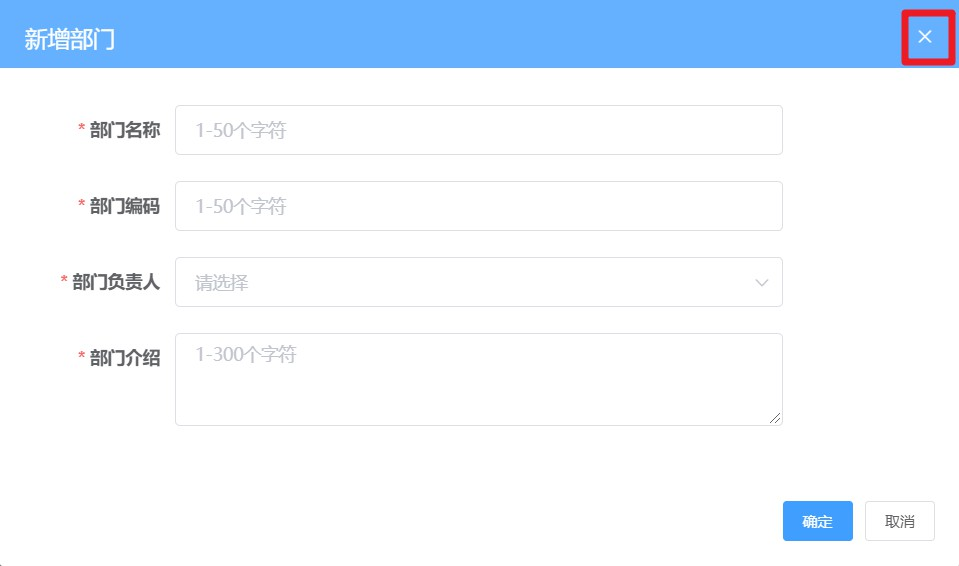

# day93

### 遗留内容：调整树形图组件样式



- `src/views/departments/index.vue`

  ```jsx
  <style lang='scss' scoped>
  .tree-card {
    padding: 30px 30px;
    font-size: 14px;
  }
  .el-tree {
    ::v-deep {
      .el-tree-node__expand-icon.expanded {
        -webkit-transform: rotate(0deg);
        transform: rotate(0deg);
      }
      .el-icon-caret-right:before {
        background: url('~@/assets/common/add-circle.png') no-repeat 0 0;
        content: '';
        display: block;
        width: 16px;
        height: 16px;
        font-size: 16px;
        background-size: 16px;
      }
      .el-tree-node__expand-icon.expanded.el-icon-caret-right:before {
        background: url('~@/assets/common/minus-circle.png') no-repeat 0 0;
        content: '';
        display: block;
        width: 16px;
        height: 16px;
        font-size: 16px;
        background-size: 16px;
      }
      .el-tree-node__expand-icon.is-leaf::before {
        background: url('~@/assets/common/user-filling.png') no-repeat 0 0;
        content: '';
        display: block;
        width: 16px;
        height: 16px;
        font-size: 16px;
        background-size: 16px;
      }
    }
  }
  </style>
  ```

## 删除部门功能实现

- 封装接口`src/api/departments.js`

  ```js
  /**
   * 删除部门
   **/
  export function reqDelDepartments(id) {
    return request({
      url: `/company/department/${id}`,
      method: 'delete'
    })
  }
  ```

- 监听下拉菜单`src/views/departments/tree-tools.vue`

  ```jsx
  <!-- 下拉菜单 element -->
  <el-dropdown @command="handleCommand">
    <span @click.stop>操作<i class="el-icon-arrow-down" /> </span>
    <!-- 下拉菜单 -->
    <el-dropdown-menu slot="dropdown">
      <el-dropdown-item command="add">添加子部门</el-dropdown-item>
      <el-dropdown-item v-if="!isRoot" command="edit">编辑部门</el-dropdown-item>
      <el-dropdown-item v-if="!isRoot" command="del">删除部门</el-dropdown-item>
    </el-dropdown-menu>
  </el-dropdown>
  ```

- ` command`事件处理函数--- [**Dropdown Events**](https://element.eleme.cn/#/zh-CN/component/dropdown)

  ```js
  methods: {
    handleCommand(type) {
      if (type === 'add') {
        console.log('添加操作')
      }
      if (type === 'edit') {
        console.log('编辑操作')
      }
      if (type === 'del') {
        console.log('删除操作')
      }
    }
  }
  /**
   * @click.native 方法可以注册原生点击事件
   */
  ```

### 删除部门事件

- 删除之前，提示用户是否删除

  ```js
  if (type === 'del') {
    this.$confirm('你确定要删除么?', '温馨提示').then(async() => {
      // 导入api删除数据
      await reqDelDepartments(this.nodeData.id)
      // 删除成功提示
      this.$message.success('删除成功')
      // 发布事件更新父组件
      this.$emit('del-depts')
    }).catch(err => {
      console.log(err)
    })
  }
  ```

- `src/views/department/index.vue`监听事件更新视图

  ```jsx
  <template #default="{ data }">
    <tree-tools
      :node-data="data"
      @del-depts="getDepartments"
    />
  </template>
  ```

## 新增部门功能

- 新增弹出层组件`src/views/department/components/add-dept.vue`（结构）

  > [**dialog**](https://element.eleme.cn/#/zh-CN/component/dialog)
  >
  > [**form**](https://element.eleme.cn/#/zh-CN/component/form)

  ```jsx
  <template>
    <!-- 新增部门的弹层 -->
    <el-dialog title="新增部门" :visible="showDialog" @close="handleCloseDialog">
      <!-- 表单组件  el-form   label-width设置label的宽度   -->
      <!-- 匿名插槽 -->
      <el-form ref="deptForm" :model="form" :rules="rules" label-width="120px">
        <el-form-item label="部门名称" prop="name">
          <el-input v-model="form.name" style="width:80%" placeholder="1-50个字符" />
        </el-form-item>
        <el-form-item label="部门编码" prop="code">
          <el-input v-model="form.code" style="width:80%" placeholder="1-50个字符" />
        </el-form-item>
        <el-form-item label="部门负责人" prop="manager">
          <el-select v-model="form.manager" style="width:80%" placeholder="请选择">
            <el-option v-for="item in people" :key="item.id" :value="item.username" :label="item.username" />
          </el-select>
        </el-form-item>
        <el-form-item label="部门介绍" prop="introduce">
          <el-input v-model="form.introduce" style="width:80%" placeholder="1-300个字符" type="textarea" :rows="3" />
        </el-form-item>
      </el-form>
      <!-- el-dialog有专门放置底部操作栏的 插槽  具名插槽 -->
      <div slot="footer">
        <el-button type="primary" size="small" @click="clickSubmit">确定</el-button>
        <el-button size="small">取消</el-button>
      </div>
    </el-dialog>
  </template>
  ```

- `src/views/departments/index.vue`引入组件

  ```jsx
  <add-dept :show-dialog="showDialog" :node-data="nodeData" :depts-list="deptsList" @add-depts="getDepartments" @close-dialog="handleClose" />
  
  import treeTools from './components/tree-tools.vue'
  import AddDept from './components/add-dept.vue'
  components: { treeTools, AddDept },
  ```

### 具体功能实现

#### 点击 x 关闭弹层 (子传父)



- `src\views\departments\components\add-dept.vue`

  ```jsx
  <!-- 注册close事件 -->
    <el-dialog title="新增部门" :visible="showDialog" @close="handleCloseDialog">
        
  handleCloseDialog() {
    // 发布事件给父组件关闭弹窗
    this.$emit('close-dialog', false)
  },
  ```

- `src/views/departments/index.vue`

  ```jsx
  <add-dept :show-dialog="showDialog" ... @close-dialog="handleClose" />
  
  // 处理事件关闭弹窗
  handleClose(isClone) {
    this.showDialog = isClone
  }
  ```

#### 点击`添加子部门`显示弹层组件

- `src/views/departments/components/tree-tools.vue`

  ```js
  handleCommand(type) {
    if (type === 'add') {
      this.$emit('add-depts', this.nodeData) // 添加子部门需要
    }
    ...
  }
  ```

- `src/views/departments/index.vue`监听事件

  ```jsx
  <template #default="{ data }">
    <tree-tools
      :node-data="data"
      @del-depts="getDepartments"
      @add-depts="handleAddDepts"
    />
  </template>
  
  data () {
    return {
      ...
      nodeData: {}
    }
  }
  
  // 处理添加操作, 显示弹层
  handleAddDepts(nodeData) {
    // 显示弹层
    this.showDialog = true
    // 存储传过来的数据, 记录下来
    this.nodeData = nodeData
  }
  ```

#### 完成新增部门的规则校验

> **表单基本校验条件**
>
> > 部门名称（name）：必填 1-50个字符  / 同级部门中禁止出现重复部门
> >
> > 部门编码（code）：必填 1-50个字符  / 部门编码在整个模块中都不允许重复
> >
> > 部门负责人（manager）：必填
> >
> > 部门介绍 ( introduce)：必填 1-300个字符

- `src/views/departments/components/add-dept.vue`准备表单

  ```jsx
  return {
    form: {
      name: '', // 部门名称
      code: '', // 部门编码
      manager: '', // 部门管理者
      introduce: '' // 部门介绍
    }
  }
  ```

- 完成表单校验需要的前置条件

  - el-form配置model和rules属性

    ```jsx
    <el-form ref="deptForm" :model="form" :rules="rules" label-width="120px">
    ...
    </el-form>
    ```

  - el-form-item配置prop属性

    ```jsx
    <el-form-item label="部门名称" prop="name">
      ...
    </el-form-item>
    <el-form-item label="部门编码" prop="code">
      ...
    </el-form-item>
    <el-form-item label="部门负责人" prop="manager">
      ...
    </el-form-item>
    <el-form-item label="部门介绍" prop="introduce">
      ...
    </el-form-item>
    ```

  - 表单进行v-model双向绑定

    ```jsx
    ...
    <el-input v-model="form.name" style="width:80%" placeholder="1-50个字符" />
    ...
    <el-input v-model="form.code" style="width:80%" placeholder="1-50个字符" />
    ...
    <el-select v-model="form.manager" style="width:80%" placeholder="请选择">
      <el-option v-for="item in people" :key="item.id" :value="item.username" :label="item.username" />
    </el-select>
    ...
    <el-input v-model="form.introduce" style="width:80%" placeholder="1-300个字符" type="textarea" :rows="3" />
    ...
    ```

- 数据准备`departments/index.vue`

  ```jsx
  <add-dept
    :show-dialog="showDialog"
    :node-data="nodeData"
    :depts-list="deptsList"
    @add-depts="getDepartments"
    @close-dialog="handleClose"
  />
  
  data() {
    return {
      deptsList: [], // 列表式数据
      ...
    }
  },
  // 获取全部的部门组织列表
  async getDepartments() {
    const { data } = await reqGetDepartments()
    this.company = {
      name: data.companyName,
      manager: '负责人'
    }
    this.departs = tranListToTreeData(data.depts, '') // 需要将其转换成树形结构
    this.deptsList = data.depts // 列表式数据
    console.log(this.departs)
  },
  ```

- 校验规则

  ```jsx
  data() {
    // 这个函数的目的是 去找 同级部门下(父id相同) 是否有重复的部门名称
    const checkNameRepeat = (rule, value, callback) => {
      // 过滤得到同级所有部门
      const arr = this.deptsList.filter(item => item.pid === this.nodeData.id)
      // 遍历同级部门, 看有没有重名的
      const flag = arr.some(item => item.name === value)
      // 判断进行校验
      flag ? callback(new Error(`同级部门下已经有${value}的部门了`)) : callback()
    }
    // 校验部门编码是否重复
    const checkCodeRepeat = (rule, value, callback) => {
      // 所有部门, 编码都唯一, 不管层级
      const isRepeat = this.deptsList.some(item => item.code === value)
      isRepeat ? callback(new Error(`已经有编码${value}的部门了`)) : callback()
    }
    return {
      form: {
        name: '', // 部门名称
        code: '', // 部门编码
        manager: '', // 部门管理者
        introduce: '' // 部门介绍
      },
      // 定义校验规则
      rules: {
        name: [
          { required: true, message: '部门名称不能为空', trigger: ['blur', 'change'] },
          { min: 1, max: 50, message: '部门名称要求1-50个字符', trigger: ['blur', 'change'] },
          { validator: checkNameRepeat, trigger: 'blur' }
        ],
        code: [
          { required: true, message: '部门编码不能为空', trigger: ['blur', 'change'] },
          { min: 1, max: 50, message: '部门编码要求1-50个字符', trigger: ['blur', 'change'] },
          { validator: checkCodeRepeat, trigger: 'blur' }
        ],
        manager: [
          { required: true, message: '部门负责人不能为空', trigger: ['blur', 'change'] }
        ],
        introduce: [
          { required: true, message: '部门介绍不能为空', trigger: ['blur', 'change'] },
          { min: 1, max: 300, message: '部门介绍要求1-300个字符', trigger: ['blur', 'change'] }
        ]
      },
      people: []
    }
  },
  ```

#### 处理首部内容的pid数据

> `添加根级别的部门`
>
> `id 指定为 ''`
>
> `表示是所有根级别的父节点`

- `src/views/departments/index.vue`

  ```jsx
  <!-- 头部 -->
  <tree-tools
    :node-data="company"
    :is-root="true"
    @add-depts="handleAddDepts"
  />
  
  // 获取全部的部门组织列表
  async getDepartments() {
    const { data } = await reqGetDepartments()
    this.company = {
      name: data.companyName,
      manager: '负责人',
      id: ''
    }
    this.departs = tranListToTreeData(data.depts, '') // 需要将其转换成树形结构
    this.deptsList = data.depts // 列表式数据
    console.log(this.departs)
  },
  ```

  