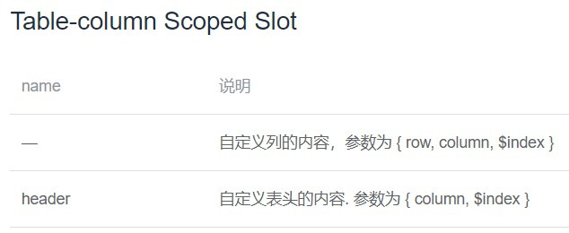
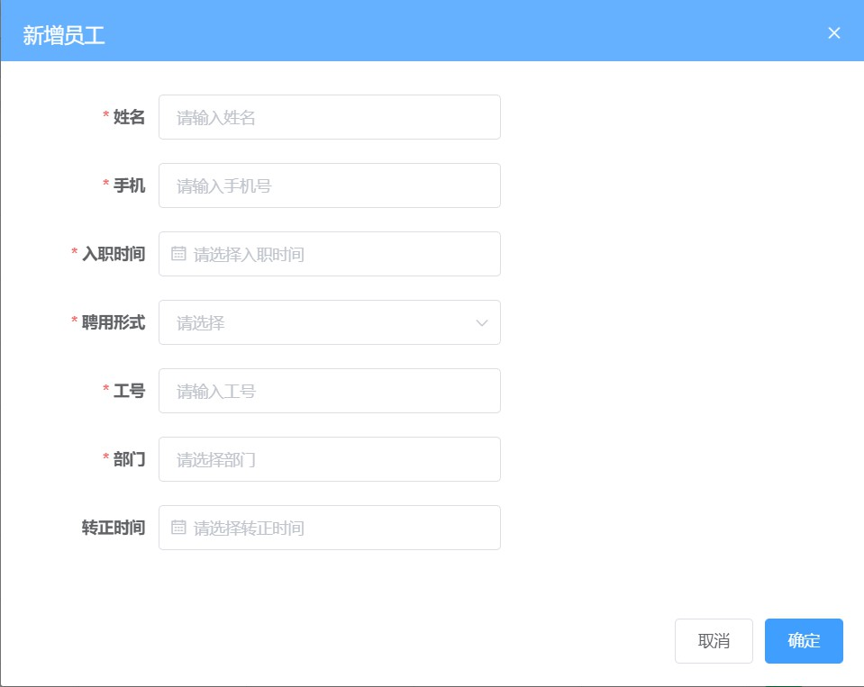

# day96

### 员工列表中的数据格式化

#### 聘用形式


> `src/api/constant`中备有枚举数据

- `src/views/employees/index.vue`

  > [**element-table-formatter**](https://element.eleme.cn/#/zh-CN/component/table)
  >
  > 

  ```jsx
  <el-table-column label="聘用形式" prop="formOfEmployment" :formatter="formatEmployment" sortable="" />
  
  import EmployeeEnum from '@/api/constant/employees'
  
  formatEmployment(row, column, cellValue, index) {
    const obj = EmployeeEnum.hireType.find(item => item.id === cellValue)
    return obj ? obj.value : '未知'
  },
  ```

#### 过滤器 - 处理时间格式

- ```bash
  yarn add moment  // 安装moment
  ```

- 封装方法`src/filters/index.js`

  ```js
  // 导入moment
  import moment from 'moment'
  
  // 格式化日期
  export function formatDate(value, str = 'YYYY-MM-DD') {
    return moment().format(str)
  }
  ```

- `main.js`（批量）注册过滤器

  ```js
  import * as filters from '@/filters' // 引入工具类
  // 注册全局的过滤器
  Object.keys(filters).forEach(key => {
    // 注册过滤器
    Vue.filter(key, filters[key])
  })
  ```

- `src/views/employees/index.vue`

  > [**Table-column Scoped Slot**](https://element.eleme.cn/#/zh-CN/component/table)
  >
  > 

  ```jsx
  <el-table-column label="入职时间" prop="timeOfEntry" sortable="">
    <template #default="{ row }">
      {{ row.timeOfEntry | formatDate }}
    </template>
  </el-table-column>
  ```

#### 账户状态 - switch开关

> [**elment-switch**](https://element.eleme.cn/#/zh-CN/component/switch)

```jsx
<el-table-column label="账户状态" prop="enableState" sortable="">
  <template #default="{row}">
    <el-switch
      :value="row.enableState===1"
      active-color="#13ce66"
      inactive-color="#ff4949"
    />
  </template>
</el-table-column>
```


### 员工列表功能实现

#### 删除员工

- 接口封装`src/api/employees.js`

  ```js
  /**
   * 删除员工 ()
   */
  export function reqDelEmployee(id) {
    return request({
      method: 'delete',
      url: `/sys/user/${id}`
    })
  }
  ```

- `src/views/employees/index.vue`

  ```jsx
  <el-button type="text" size="small" @click="delEmployee(row.id)">删除</el-button>
  
  delEmployee(id) {
    this.$confirm('确认删除该员工?', '温馨提示').then(
      async() => {
        await reqDelEmployee(id)
        if (this.list.length === 1 && this.page > 1) {
          this.page--
        }
        this.$message.success('删除成功')
        this.getEmployeeList()
      }
    ).catch(() => {
      console.log('取消')
    })
  }
  ```

#### 新增员工

- 新建`src/views/employees/components/add-employee.vue`（结构样式）

  ```jsx
  <template>
    <el-dialog title="新增员工" :visible="dialogFormVisible" top="8vh" @close="closeDialog">
      <!-- 表单 -->
      <el-form ref="addForm" :model="formData" :rules="rules" label-width="120px">
        <el-form-item label="姓名" prop="username">
          <el-input v-model="formData.username" style="width:50%" placeholder="请输入姓名" />
        </el-form-item>
        <el-form-item label="手机" prop="mobile">
          <el-input v-model="formData.mobile" style="width:50%" placeholder="请输入手机号" />
        </el-form-item>
        <el-form-item label="入职时间" prop="timeOfEntry">
          <el-date-picker v-model="formData.timeOfEntry" style="width:50%" placeholder="请选择入职时间" />
        </el-form-item>
        <el-form-item label="聘用形式" prop="formOfEmployment">
          <el-select v-model="formData.formOfEmployment" style="width:50%" placeholder="请选择">
            <el-option v-for="item in EmployeeEnum.hireType" :key="item.id" :label="item.value" :value="item.id" />
          </el-select>
        </el-form-item>
        <el-form-item label="工号" prop="workNumber">
          <el-input v-model="formData.workNumber" style="width:50%" placeholder="请输入工号" />
        </el-form-item>
        <el-form-item label="部门" prop="departmentName">
          <el-input :value="formData.departmentName" style="width:50%" placeholder="请选择部门" @focus="getDepartments" />
          <div v-if="showTree" class="tree-box">
            <el-tree
              v-loading="loading"
              :data="treeData"
              :props="{ label: 'name' }"
              @node-click="selectNode"
            />
          </div>
        </el-form-item>
        <el-form-item label="转正时间" prop="correctionTime">
          <el-date-picker v-model="formData.correctionTime" style="width:50%" placeholder="请选择转正时间" />
        </el-form-item>
      </el-form>
      <!-- footer插槽 -->
      <template v-slot:footer>
        <el-button @click="closeDialog">取消</el-button>
        <el-button type="primary" @click="submitAdd">确定</el-button>
      </template>
    </el-dialog>
  </template>
  
  <style lang='scss' scoped>
  .tree-box{
    position: relative;
    .el-tree{
        position: absolute;
        top: 20px;
        width: 50%;
        min-height: 50px;
        border: 2px solid #ccc;
        border-radius: 5px;
        z-index: 999;
        padding-right: 5px;
        background-color: #fff;
      }
  }
  </style>
  ```

- `src/views/employees/index.vue`注册使用提供**弹框**条件

  ```jsx
  <add-employee :dialog-form-visible.sync="dialogFormVisible" />
  
  import addEmployee from './components/add-employee.vue'
  
  components: { addEmployee },
  
  data() {
    return {
      ...
      dialogFormVisible: false
    }
  },
  ```

##### `add-employee.vue`组件功能

**预期效果**



- 准备员工表单内容以及校验内容

  ```jsx
  data() {
    return {
      formData: {
        username: '', // 用户名
        mobile: '', // 手机号
        formOfEmployment: '', // 聘用形式
        workNumber: '', // 工号
        departmentName: '', // 部门
        timeOfEntry: '', // 入职时间
        correctionTime: '' // 转正时间
      },
      rules: {
        username: [
          { required: true, message: '用户姓名不能为空', trigger: ['blur', 'change'] },
          { min: 1, max: 4, message: '用户姓名为1-4位', trigger: ['blur', 'change'] }
        ],
        mobile: [
          { required: true, message: '手机号不能为空', trigger: ['blur', 'change'] },
          { pattern: /^1[3-9]\d{9}$/, message: '手机号格式不正确', trigger: ['blur', 'change'] }
        ],
        formOfEmployment: [
          { required: true, message: '聘用形式不能为空', trigger: ['blur', 'change'] }
        ],
        workNumber: [
          { required: true, message: '工号不能为空', trigger: ['blur', 'change'] }
        ],
        departmentName: [
          { required: true, message: '部门不能为空', trigger: ['blur', 'change'] }
        ],
        timeOfEntry: [
          { required: true, message: '请选择入职时间', trigger: ['blur', 'change'] }
        ]
      },
      ...
    }
  },
  ```

- 处理功能按钮（关闭弹窗）

  ```jsx
  <el-dialog title="新增员工" :visible="dialogFormVisible" top="8vh" @close="closeDialog">
  
  <!-- footer插槽 -->
  <template v-slot:footer>
    <el-button @click="closeDialog">取消</el-button>
    ...
  </template>
      
  closeDialog() {
    // 重置原来的数据
    this.formData = {
      username: '',
      mobile: '',
      formOfEmployment: '',
      workNumber: '',
      departmentName: '',
      timeOfEntry: '',
      correctionTime: ''
    }
    this.$refs.addForm.resetFields() // 重置校验结果
    this.$emit('update:dialogFormVisible', false)
  }
  ```

- 部门的树形图展示

  > [**elment-tree**](https://element.eleme.cn/#/zh-CN/component/tree)

  ```jsx
  <div v-if="showTree" class="tree-box">
    <el-tree
      v-loading="loading"
      :data="treeData"
      :props="{ label: 'name' }"
      @node-click="selectNode"
    />
  </div>
  
  import { reqGetDepartments } from '@/api/departments'
  import { tranListToTreeData } from '@/utils'
  
  data() {
    return {
      ...
      treeData: [],
      showTree: false, // 是否显示tree
      loading: false, // 是否加载中
    }
  }
  
  async getDepartments() {
    this.showTree = true
    this.loading = true
    const { data } = await reqGetDepartments()
    // depts是数组 但不是树形, 需要转换成属性结构, 才能被 el-tree 展示
    this.treeData = tranListToTreeData(data.depts, '')
    this.loading = false
    console.log(this.treeData)
  }
  ```

- 点击选择部门 - 赋值表单数据

  > 

  ```js
  selectNode(nodeData) {
    // 该还有子节点, 就是展开操作, 不管
    if (nodeData.children && nodeData.children.length > 0) return
    this.formData.departmentName = nodeData.name
    this.showTree = false
  }
  ```

- 聘用形式的渲染

  ```jsx
  <el-form-item label="聘用形式" prop="formOfEmployment">
    <el-select v-model="formData.formOfEmployment" style="width:50%" placeholder="请选择">
      <el-option v-for="item in EmployeeEnum.hireType" :key="item.id" :label="item.value" :value="item.id" />
    </el-select>
  </el-form-item>
  
  import EmployeeEnum from '@/api/constant/employees'
  
  data() {
    return {
      EmployeeEnum,
      ...
    }
  }
  ```

  

- 新增工呢（确认表单提交）

  - 封装接口`src/api/employees.js`

    ```js
    /** **
     *  新增员工的接口
     * **/
    export function reqAddEmployee(data) {
      return request({
        method: 'post',
        url: '/sys/user',
        data
      })
    }
    ```

  - 注册使用

    ```jsx
    <el-button type="primary" @click="submitAdd">确定</el-button>
    
    import { reqAddEmployee } from '@/api/employees'
    
    submitAdd() {
      this.$refs.addForm.validate(async flag => {
        if (!flag) return
        await reqAddEmployee(this.formData)
        this.$message.success('添加成功')
        this.$parent.getEmployeeList()
        this.closeDialog()
      })
    }
    ```

## excel导入组件封装


> 相似组件封装[**vue-element-admin**](https://github.com/PanJiaChen/vue-element-admin/blob/master/src/components/UploadExcel/index.vue)
>
> [**码云地址**](https://gitee.com/panjiachen/vue-element-admin/blob/master/src/components/UploadExcel/index.vue)

- 安装依赖

  ```bash
  $ yarn add xlsx
  ```

- 新建组件`src/components/UploadExcel/index.vue`

  ```jsx
  <template>
    <div class="upload-excel">
      <!-- 左侧按钮 -->
      <div class="btn-upload">
        <el-button :loading="loading" size="mini" type="primary" @click="handleUpload">
          点击上传
        </el-button>
      </div>
  
      <!-- 文件选择框 -->
      <!-- accept=".xlsx, .xls", h5新增的属性, 表示可以接收的文件后缀格式, 只能选择excel的文件 -->
      <input ref="excel-upload-input" class="excel-upload-input" type="file" accept=".xlsx, .xls" @change="handleClick">
  
      <!-- 右侧拖拽区域 -->
      <div class="drop" @drop="handleDrop" @dragover="handleDragover" @dragenter="handleDragover">
        <i class="el-icon-upload" />
        <span>将文件拖到此处</span>
      </div>
    </div>
  </template>
  
  <script>
  // 1. 点击按钮
  // 2. 触发了file的click, 弹出了选择框
  // 3. 用户选择文件, 触发了change
  // 4. 在change事件中, 拿到选择的文件对象, 考虑进行处理
  // 5. 判断有没有传递校验函数 beforeUpload, 传递了就用它校验一下
  // 6. 校验通过, 才开始读文件, fileReader 读文件, 读出buffer字节流的数据, 使用插件XLSX解析
  // 7. 解析得到数据, 调用传递的 onSuccess 函数
  
  import XLSX from 'xlsx' // 解析excel的插件
  export default {
    props: {
      // 父传子配置的校验函数
      beforeUpload: Function, // eslint-disable-line
      // 父传子配置的成功函数
      onSuccess: Function// eslint-disable-line
    },
    data() {
      return {
        loading: false,
        excelData: {
          header: null,
          results: null
        }
      }
    },
    methods: {
      generateData({ header, results }) {
        this.excelData.header = header
        this.excelData.results = results
        this.onSuccess && this.onSuccess(this.excelData)
      },
      handleDrop(e) {
        e.stopPropagation()
        e.preventDefault()
        if (this.loading) return
        const files = e.dataTransfer.files
        if (files.length !== 1) {
          this.$message.error('Only support uploading one file!')
          return
        }
        const rawFile = files[0] // only use files[0]
        if (!this.isExcel(rawFile)) {
          this.$message.error('Only supports upload .xlsx, .xls, .csv suffix files')
          return false
        }
        this.upload(rawFile)
        e.stopPropagation()
        e.preventDefault()
      },
      handleDragover(e) {
        e.stopPropagation()
        e.preventDefault()
        e.dataTransfer.dropEffect = 'copy'
      },
      handleUpload() {
        this.$refs['excel-upload-input'].click()
      },
      // 用户选择了excel文件 (change事件)
      handleClick(e) {
        const files = e.target.files
        const rawFile = files[0] // 通过files[0]拿到选择的那个excel文件
        if (!rawFile) return
        // 拿到原始文件对象
        this.upload(rawFile)
      },
      upload(rawFile) {
        // 拿到了选择的文件对象后, 清空了原有的file框的内容
        this.$refs['excel-upload-input'].value = null // fix can't select the same excel
  
        // 看父传子有没传递beforeUpload函数
        if (!this.beforeUpload) {
          // 就开始读 excel 了
          this.readerData(rawFile)
          return
        }
  
        // beforeUpload会要求你返回一个布尔值,
        // true意味着通过了校验
        // false意味着没通过校验, 没通过校验, 不会开始读excel
        const before = this.beforeUpload(rawFile)
        if (before) {
          // 就开始读 excel 了
          this.readerData(rawFile)
        }
      },
  
      // 开始读excel
      readerData(rawFile) {
        this.loading = true
        return new Promise((resolve, reject) => {
          // h5中新增的, 读取文件的api, fileReader
          const reader = new FileReader()
  
          // 读文件需要时间, onload触发时, 才是文件读完的时候
          reader.onload = e => {
            const data = e.target.result
            const workbook = XLSX.read(data, { type: 'array' })
            const firstSheetName = workbook.SheetNames[0]
            const worksheet = workbook.Sheets[firstSheetName]
            const header = this.getHeaderRow(worksheet)
            const results = XLSX.utils.sheet_to_json(worksheet)
            this.generateData({ header, results })
            this.loading = false // 关闭加载状态, 读完了
  
            resolve()
          }
          reader.readAsArrayBuffer(rawFile)
        })
      },
      getHeaderRow(sheet) {
        const headers = []
        const range = XLSX.utils.decode_range(sheet['!ref'])
        let C
        const R = range.s.r
        /* start in the first row */
        for (C = range.s.c; C <= range.e.c; ++C) { /* walk every column in the range */
          const cell = sheet[XLSX.utils.encode_cell({ c: C, r: R })]
          /* find the cell in the first row */
          let hdr = 'UNKNOWN ' + C // <-- replace with your desired default
          if (cell && cell.t) hdr = XLSX.utils.format_cell(cell)
          headers.push(hdr)
        }
        return headers
      },
      isExcel(file) {
        return /\.(xlsx|xls|csv)$/.test(file.name)
      }
    }
  }
  </script>
  
  <style scoped lang="scss">
  .upload-excel {
    display: flex;
    justify-content: center;
    margin-top: 100px;
    .excel-upload-input {
      display: none;
      z-index: -9999;
    }
    .btn-upload,
    .drop {
      border: 1px dashed #bbb;
      width: 350px;
      height: 160px;
      text-align: center;
      line-height: 160px;
    }
    .drop {
      padding-top: 20px;
      line-height: 80px;
      color: #bbb;
      i {
        font-size: 60px;
        display: block;
      }
    }
  }
  </style>
  
  ```

- 全局注册组件`src/components/index.js`

  ```js
  // 该文件负责所有的公共组件的全局注册
  // vue插件机制: Vue.use
  import PageTools from './PageTools'
  import UploadExcel from './UploadExcel'
  export default {
    install(Vue) {
      Vue.component('PageTools', PageTools)
      Vue.component('UploadExcel', UploadExcel)
    }
  }
  
  ```

### 建立公共导入的页面路由

- 封装导入接口`src/api/employees.js`

  ```js
  /** *
   * 封装一个导入员工的接口
   * ***/
  export function reqImportEmployee(data) {
    return request({
      url: '/sys/user/batch',
      method: 'post',
      data
    })
  }
  ```

- `src/views/employees/index.vue`处理**excel导入**按钮

  ```jsx
  <el-button
    size="small"
    type="warning"
    // 点击跳转导入界面，并携带type值作为（从哪个页面跳转）的依据
    @click="$router.push('/import?type=user')"
  >
    excel导入
  </el-button>
  ```

- 新建组件`src/views/import/index.vue`

  ```vue
  <template>
    <div class="import-container">
      <upload-excel :before-upload="beforeUploadFn" :on-success="handleSuccess" />
    </div>
  </template>
  
  <script>
  export default {
    name: 'Import',
    methods: {
      // 配置读取, 操作, 之前的校验
      beforeUploadFn(rawFile) {
        // 文件大小的校验
        if (rawFile.size > 20 * 1024 * 1024) {
          this.$message.error('文件过大, 文件大小在20M以内')
          return false
        }
        return true
      },
    }
  }
  </script>
  ```
  
- `src/router/index.js`

  ```js
  export const constantRoutes = [
    ...
    {
      path: '/import',
      component: Layout,
      hidden: true,
      children: [{
        path: '',
        component: () => import('@/views/import')
      }]
    },
    // 404 page must be placed at the end !!!
    { path: '*', redirect: '/404', hidden: true }
  ]
  ```


