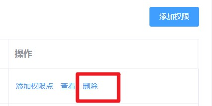

# day98

### 打印

- 配置路由`src/router/modules/employees.js`

  ```js
  export default {
    path: '/employees',
    component: Layout,
    children: [
      ...
      {
        path: 'print/:id',
        component: () => import('@/views/employees/components/print'),
        hidden: true,
        meta: {
          title: '打印'
        }
      }
    ]
  }
  ```

- 设置按钮`src/views/employees/components/detail.vue`

  ```jsx
  <el-tab-pane label="个人详情">
    <el-tooltip class="tooltip-box" content="打印基本个人信息">
      <router-link :to="`/employees/print/${userId}?type=personal`">
        <i class="el-icon-printer" />
      </router-link>
    </el-tooltip>
    
    <user-info />
  </el-tab-pane>
  
  <el-tab-pane label="岗位信息">
    <el-tooltip class="tooltip-box" content="打印基本岗位信息">
      <router-link :to="`/employees/print/${userId}?type=job`">
        <i class="el-icon-printer" />
      </router-link>
    </el-tooltip>
    
    <job-info />
  </el-tab-pane>
  
  <style lang="scss" scoped>
  .el-tabs{
    .el-tab-pane{
      padding-top: 10px;
    }
    .tooltip-box{
      position: absolute;
      right: 30px;
      right: 10px;
      z-index: 999;
    }
  }
  </style>
  ```

- 新建打印组件`src/views/employees/components/print.vue`

  ```jsx
  <template>
    <div id="myPrint" class="dashboard-container">
      <div class="app-container">
        <el-card>
          <el-breadcrumb separator="/" class="titInfo ">
            <el-breadcrumb-item :to="{ path: '/' }">首页</el-breadcrumb-item>
            <el-breadcrumb-item>
              <router-link :to="{'path':'/employees'}">员工管理</router-link>
            </el-breadcrumb-item>
            <el-breadcrumb-item>打印</el-breadcrumb-item>
          </el-breadcrumb>
  
          <div style="text-align: right; margin-top: 10px;">
            <!-- v-print 指令, 内容会帮你注册点击事件, 点击时开始打印 -->
            <!-- 可以指定 id, 打印指定的盒子 -->
            <el-button v-print="{ id: 'printbox' }" type="primary" size="small">打印</el-button>
          </div>
  
          <!-- 员工 -->
          <div v-if="type === 'personal'" id="printbox">
            <h2 class="centInfo">员工信息表</h2>
            <table cellspacing="0" width="100%" class="tableList">
              <tr class="title">
                <td colspan="8" class="centInfo">基本信息</td>
              </tr>
              <tr>
                <th style="width:10%">姓名</th>
                <td colspan="6" style="width:80%">{{ formData.username }}</td>
                <td rowspan="5" style="width:10%"></td>
  
              </tr>
              <tr>
                <th>性别</th>
                <td colspan="6">{{ formData.sex }}</td>
              </tr>
              <tr>
                <th>手机</th>
                <td colspan="6">{{ formData.mobile }}</td>
              </tr>
              <tr>
                <th>出生日期</th>
                <td colspan="6">{{ formData.dateOfBirth | formatDate }}</td>
              </tr>
              <tr>
                <th>最高学历</th>
                <td colspan="6">{{ formData.theHighestDegreeOfEducation }}</td>
              </tr>
              <tr>
                <th style="width:10%">是否可编辑</th>
                <td style="width:35%">{{ formData.isItEditable }}</td>
                <th style="width:10%">是否隐藏号码</th>
                <td colspan="5" style="width:45%">{{ formData.doYouHideNumbers }}</td>
              </tr>
              <tr>
                <th>国家地区</th>
                <td>{{ formData.nationalArea }}</td>
                <th>护照号</th>
                <td colspan="5">{{ formData.passportNo }}</td>
              </tr>
              <tr>
                <th>身份证号</th>
                <td>{{ formData.idNumber }}</td>
                <th>身份证照片</th>
                <td colspan="5">{{ formData.iDCardPhoto }}</td>
              </tr>
              <tr>
                <th>籍贯</th>
                <td>{{ formData.nativePlace }}</td>
                <th>民族</th>
                <td colspan="5">{{ formData.nation }}</td>
              </tr>
              <tr>
                <th>英文名</th>
                <td>{{ formData.englishName }}</td>
                <th>婚姻状况</th>
                <td colspan="5">{{ formData.maritalStatus }}</td>
              </tr>
              <tr>
                <th>员工照片</th>
                <td>{{ formData.staffPhoto }}</td>
                <th>生日</th>
                <td colspan="5">{{ formData.birthday }}</td>
              </tr>
              <tr>
                <th>属相</th>
                <td>{{ formData.zodiac }}</td>
                <th>年龄</th>
                <td colspan="5">{{ formData.age }}</td>
              </tr>
              <tr>
                <th>星座</th>
                <td>{{ formData.constellation }}</td>
                <th>血型</th>
                <td colspan="5">{{ formData.bloodType }}</td>
              </tr>
              <tr>
                <th>户籍所在地</th>
                <td>{{ formData.domicile }}</td>
                <th>政治面貌</th>
                <td colspan="5">{{ formData.politicalOutlook }}</td>
              </tr>
              <tr>
                <th>入党时间</th>
                <td>{{ formData.timeToJoinTheParty }}</td>
                <th>存档机构</th>
                <td colspan="5">{{ formData.archivingOrganization }}</td>
              </tr>
              <tr>
                <th>子女状态</th>
                <td>{{ formData.stateOfChildren }}</td>
                <th>子女有无商业保险</th>
                <td colspan="5">{{ formData.doChildrenHaveCommercialInsurance }}</td>
              </tr>
              <tr>
                <th>有无违法违纪行为</th>
                <td>{{ formData.isThereAnyViolationOfLawOrDiscipline }}</td>
                <th>有无重大病史</th>
                <td colspan="5">{{ formData.areThereAnyMajorMedicalHistories }}</td>
              </tr>
              <tr class="title">
                <td colspan="8" class="centInfo">通讯信息</td>
              </tr>
              <tr>
                <th>QQ</th>
                <td>{{ formData.qQ }}</td>
                <th>微信</th>
                <td colspan="5">{{ formData.weChat }}</td>
              </tr>
              <tr>
                <th>居住证城市</th>
                <td>{{ formData.residenceCardCity }}</td>
                <th>居住证办理日期</th>
                <td colspan="5">{{ formData.dateOfResidencePermit }}</td>
              </tr>
              <tr>
                <th>居住证截止日期</th>
                <td>{{ formData.residencePermitDeadline }}</td>
                <th>现居住地</th>
                <td colspan="5">{{ formData.placeOfResidence }}</td>
              </tr>
              <tr>
                <th>通讯地址</th>
                <td>{{ formData.postalAddress }}</td>
                <th>联系手机</th>
                <td colspan="5">{{ formData.contactTheMobilePhone }}</td>
              </tr>
              <tr>
                <th>个人邮箱</th>
                <td>{{ formData.personalMailbox }}</td>
                <th>紧急联系人</th>
                <td colspan="5">{{ formData.emergencyContact }}</td>
              </tr>
              <tr>
                <th>紧急联系电话</th>
                <td colspan="7">{{ formData.emergencyContactNumber }}</td>
              </tr>
              <tr class="title">
                <td colspan="8" class="centInfo">账号信息</td>
              </tr>
              <tr>
                <th>社保电脑号</th>
                <td>{{ formData.socialSecurityComputerNumber }}</td>
                <th>公积金账号</th>
                <td colspan="5">{{ formData.providentFundAccount }}</td>
              </tr>
              <tr>
                <th>银行卡号</th>
                <td>{{ formData.bankCardNumber }}</td>
                <th>开户行</th>
                <td colspan="5">{{ formData.openingBank }}</td>
              </tr>
              <tr class="title">
                <td colspan="8" class="centInfo">教育信息</td>
              </tr>
              <tr>
                <th>学历类型</th>
                <td>{{ formData.educationalType }}</td>
                <th>毕业学校</th>
                <td colspan="5">{{ formData.graduateSchool }}</td>
              </tr>
              <tr>
                <th>入学时间</th>
                <td>{{ formData.enrolmentTime }}</td>
                <th>毕业时间</th>
                <td colspan="5">{{ formData.graduationTime }}</td>
              </tr>
              <tr>
                <th>专业</th>
                <td>{{ formData.major }}</td>
                <th>毕业证书</th>
                <td colspan="5">{{ formData.graduationCertificate }}</td>
              </tr>
              <tr>
                <th>学位证书</th>
                <td colspan="7">{{ formData.certificateOfAcademicDegree }}</td>
              </tr>
              <tr class="title">
                <td colspan="8" class="centInfo">从业信息</td>
              </tr>
              <tr>
                <th>上家公司</th>
                <td>{{ formData.homeCompany }}</td>
                <th>职称</th>
                <td colspan="5">{{ formData.title }}</td>
              </tr>
              <tr>
                <th>简历</th>
                <td>{{ formData.resume }}</td>
                <th>有无竞业限制</th>
                <td colspan="5">{{ formData.isThereAnyCompetitionRestriction }}</td>
              </tr>
              <tr>
                <th>前公司离职证明</th>
                <td>{{ formData.proofOfDepartureOfFormerCompany }}</td>
                <th>备注</th>
                <td colspan="5">{{ formData.remarks }}</td>
              </tr>
            </table>
            <div class="foot">签字：___________日期:___________</div>
          </div>
  
          <!-- 岗位 -->
          <div v-else id="printbox">
            <h2 class="centInfo">岗位信息表</h2>
            <table cellspacing="0" width="100%" class="tableList">
              <tr class="title">
                <td colspan="4" class="centInfo">基本信息</td>
              </tr>
              <tr>
                <th style="width:10%">姓名</th>
                <td style="width:40%">{{ formData.username }}</td>
                <th style="width:10%">入职日期</th>
                <td style="width:40%">{{ formData.dateOfEntry }}</td>
              </tr>
              <tr>
                <th>部门</th>
                <td>{{ formData.departmentName }}</td>
                <th>岗位</th>
                <td>{{ formData.post }}</td>
              </tr>
              <tr>
                <th>工作邮箱</th>
                <td>{{ formData.workMailbox }}</td>
                <th>工号</th>
                <td>{{ formData.workNumber }}</td>
              </tr>
              <tr>
                <th>转正日期</th>
                <td>{{ formData.dateOfCorrection }}</td>
                <th>转正状态</th>
                <td>{{ formData.stateOfCorrection }}</td>
              </tr>
              <tr>
                <th>职级</th>
                <td>{{ formData.rank }}</td>
                <th>汇报对象</th>
                <td>{{ formData.reportName }}</td>
              </tr>
              <tr>
                <th>HRBP</th>
                <td>{{ formData.hRBP }}</td>
                <th>聘用形式</th>
                <td>{{ formData.formOfEmployment }}</td>
              </tr>
  
              <tr>
                <th>管理形式</th>
                <td>{{ formData.formOfManagement }}</td>
                <th>调整司龄</th>
                <td>{{ formData.adjustmentAgedays }}</td>
              </tr>
              <tr>
                <th>司龄</th>
                <td>{{ formData.ageOfDivision }}</td>
                <th>首次参加工作时间</th>
                <td>{{ formData.workingTimeForTheFirstTime }}</td>
              </tr>
  
              <tr>
                <th>调整工龄天</th>
                <td>{{ formData.adjustmentOfLengthOfService }}</td>
                <th>工龄</th>
                <td>{{ formData.workingYears }}</td>
              </tr>
              <tr>
                <th>纳税城市</th>
                <td>{{ formData.taxableCity }}</td>
                <th>转正评价</th>
                <td>{{ formData.correctionEvaluation }}</td>
              </tr>
              <tr class="title">
                <td colspan="4" class="centInfo">合同信息</td>
              </tr>
              <tr>
                <th>首次合同开始时间</th>
                <td>{{ formData.initialContractStartTime }}</td>
                <th>首次合同结束时间</th>
                <td>{{ formData.firstContractTerminationTime }}</td>
              </tr>
              <tr>
                <th>现合同开始时间</th>
                <td>{{ formData.currentContractStartTime }}</td>
                <th>现合同结束时间</th>
                <td>{{ formData.closingTimeOfCurrentContract }}</td>
              </tr>
  
              <tr>
                <th>合同期限</th>
                <td>{{ formData.contractPeriod }}</td>
                <th>合同文件</th>
                <td>{{ formData.contractDocuments }}</td>
              </tr>
              <tr>
                <th>续签次数</th>
                <td colspan="3">{{ formData.renewalNumber }}</td>
              </tr>
              <tr class="title">
                <td colspan="4" class="centInfo">招聘信息</td>
              </tr>
              <tr>
                <th>其他招聘渠道</th>
                <td>{{ formData.otherRecruitmentChannels }}</td>
                <th>招聘渠道</th>
                <td>{{ formData.recruitmentChannels }}</td>
              </tr>
              <tr>
                <th>社招校招</th>
                <td>{{ formData.socialRecruitment }}</td>
                <th>推荐企业人</th>
                <td>{{ formData.recommenderBusinessPeople }}</td>
              </tr>
            </table>
            <div class="foot">签字：___________日期:___________</div>
          </div>
        </el-card>
      </div>
    </div>
  </template>
  
  <script>
  import { reqGetPersonalDetail, reqGetJobDetail } from '@/api/employees'
  import { reqGetUserDetailById } from '@/api/user'
  export default {
    data() {
      return {
        formData: {}
      }
    },
    computed: {
      userId() {
        return this.$route.params.id
      },
      type() {
        return this.$route.query.type
      }
    },
    // 创建完毕状态
    created() {
      if (this.type === 'personal') {
        this.getPersonalDetail()
      } else {
        this.getJobDetail()
      }
    },
    // 组件更新
    methods: {
      async getPersonalDetail() {
        const { data: userInfo } = await reqGetUserDetailById(this.userId) // 获取个人基本信息(顶部)
        const { data: detail } = await reqGetPersonalDetail(this.userId) // 获取个人基本信息(底部)
        this.formData = { ...detail, ...userInfo }
      },
      async getJobDetail() {
        const { data: userInfo } = await reqGetUserDetailById(this.userId)
        const { data: jobInfo } = await reqGetJobDetail(this.userId) // 获取个人基本信息
        this.formData = { ...jobInfo, ...userInfo }
      }
    }
  }
  </script>
  
  <style lang="scss">
  .foot {
    padding: 30px 0;
    text-align: right;
  }
  </style>
  
  ```

- 下载插件依赖

  ```bash
  $ yarn add vue-print-nb
  ```

- 注册插件`src/main.js`

  ```js
  import Print from 'vue-print-nb'
  Vue.use(Print)
  ```


### 权限设计和管理

> **给员工分配角色**
>
> **给角色分配权限**


#### 分配角色弹框

- 新建组件`src/views/employees/components/assign-role.vue`(结构)

  ```jsx
  <template>
    <el-dialog class="assign-role" title="分配角色" :visible="showRoleDialog" @open="dialogOpen" @close="closeDialog">
      <!-- el-checkbox-group选中的是 当前用户所拥有的角色  需要绑定 当前用户拥有的角色-->
      <el-checkbox-group v-model="roleIds" v-loading="loading">
        <el-checkbox v-for="item in list" :key="item.id" :label="item.id">
          {{ item.name }}
        </el-checkbox>
      </el-checkbox-group>
  
      <template #footer>
        <div style="text-align: right">
          <el-button type="primary" @click="clickSubmit">确定</el-button>
          <el-button @click="closeDialog">取消</el-button>
        </div>
      </template>
    </el-dialog>
  </template>
  
  <style lang="scss" scoped>
  .assign-role {
    ::v-deep {
      .el-checkbox {
        font-size: 30px;
      }
    }
  }
  </style>
  
  ```

- 弹层的显示和关闭`src/views/employees/index.vue`(父组件)

  

  ```jsx
  <el-button type="text" size="small" @click="$router.push(`/employees/detail/${row.id}`)">查看</el-button>
  
  
  <assign-role :show-role-dialog.sync="showRoleDialog" :user-id="userId" />
  
  import addEmployee from './components/add-employee.vue'
  
  components: { addEmployee, AssignRole },
  
  
  data() {
    return {
      ...
      showRoleDialog: false,
      userId: null
    }
  },
      
  methods: {
    ...
    editRole(id) {
      this.userId = id
      this.showRoleDialog = true
    }
  }
  ```

- `src/views/employees/components/assign-role.vue`(子组件)

  ```jsx
  <script>
  import { reqGetRoleList } from '@/api/setting'
  import { reqGetUserDetailById } from '@/api/user'
  import { reqAssignRoles } from '@/api/employees'
  export default {
    props: {
      showRoleDialog: {
        type: Boolean,
        default: false
      },
      // 用户的id 用来查询当前用户的角色信息
      userId: {
        type: String,
        default: null
      }
    },
    data() {
      return {
        list: [],
        roleIds: [],
        loading: false
      }
    },
    created() {
      this.getRoleList()
    },
    methods: {
      closeDialog() {
        this.$emit('update:showRoleDialog', false)
      },
      async getRoleList() {
        const { data } = await reqGetRoleList(1, 100)
        this.list = data.rows
      },
      async getUserDetailById() {
        const { data } = await reqGetUserDetailById(this.userId)
        this.roleIds = data.roleIds
      },
      dialogOpen() {
        this.loading = true
        Promise.all([this.getRoleList(), this.getUserDetailById()]).then(() => {
          this.loading = false
        })
      },
      async clickSubmit() {
        await reqAssignRoles({
          id: this.userId,
          roleIds: this.roleIds
        })
        this.closeDialog()
      }
    }
  }
  </script>
  
  ```

- 分配角色接口  `api/employees.js`

  ```js
  /** *
   * 给员工分配角色
   * ***/
  export function reqAssignRoles(data) {
    return request({
      url: '/sys/user/assignRoles',
      data,
      method: 'put'
    })
  }
  ```

## 权限点管理页面

- CRUD接口封装`src/api/permisson.js`

  ```js
  import request from '@/utils/request'
  
  // 获取权限
  export function reqGetPermissionList() {
    return request({
      method: 'get',
      url: '/sys/permission'
    })
  }
  // 新增权限
  export function reqAddPermission(data) {
    return request({
      method: 'post',
      url: '/sys/permission',
      data
    })
  }
  
  // 更新权限
  export function reqUpdatePermission(data) {
    return request({
      method: 'put',
      url: `/sys/permission/${data.id}`,
      data
    })
  }
  
  // 删除权限
  export function reqDelPermission(id) {
    return request({
      method: 'delete',
      url: `/sys/permission/${id}`
    })
  }
  // 获取权限详情
  export function reqGetPermissionDetail(id) {
    return request({
      method: 'get',
      url: `/sys/permission/${id}`
    })
  }
  ```

-  `src/views/permission/index.vue`(结构)

  ```jsx
  <template>
    <div class="permission-container">
      <div class="app-container">
        <!-- 表格 -->
        <el-card>
          <div style="text-align: right; margin-bottom: 20px">
            <el-button type="primary" size="small" @click="clickAdd(1, '0')">添加权限</el-button>
          </div>
          <el-table border :data="list" row-key="id">
            <el-table-column label="名称" prop="name" />
            <el-table-column label="标识" prop="code" />
            <el-table-column label="描述" prop="description" />
            <el-table-column label="操作">
              <template #default="{ row }">
                <el-button v-if="row.type === 1" size="small" type="text" @click="clickAdd(2, row.id)">添加权限点</el-button>
                <el-button size="small" type="text" @click="clickShowEdit(row.id)">查看</el-button>
                <el-button size="small" type="text" @click="clickDel(row.id)">删除</el-button>
              </template>
            </el-table-column>
          </el-table>
        </el-card>
        <add-permission ref="addPermission" :show-dialog.sync="showDialog" />
      </div>
    </div>
  </template>
  ```

- 获取权限数据并转化树形

  ```jsx
  import { reqGetPermissionList } from '@/api/permission'
  import { tranListToTreeData } from '@/utils'
  
  export default {
    name: 'Permission',
    data() {
      return {
        list: []
      }
    },
    created() {
      this.getPermissionList()
    },
    methods: {
      async getPermissionList() {
        const { data } = await reqGetPermissionList()
        this.list = tranListToTreeData(data, '0')
        console.log(this.list)
      }
    }
  }
  ```

- 新建弹窗组件`src/views/permission/components/add-permission.vue`(结构)

  ```jsx
  <template>
    <!-- 新增编辑的弹层 -->
    <el-dialog :visible="showDialog" :title="showTitle" @close="closeDialog">
      <!-- 表单内容 -->
      <el-form label-width="100px">
        <el-form-item label="权限名称">
          <el-input v-model="formData.name" />
        </el-form-item>
        <el-form-item label="权限标识">
          <el-input v-model="formData.code" />
        </el-form-item>
        <el-form-item label="权限描述">
          <el-input v-model="formData.description" />
        </el-form-item>
        <el-form-item label="权限启用">
          <el-switch
            v-model="formData.enVisible"
            active-text="启用"
            active-value="1"
            inactive-text="不启用"
            inactive-value="0"
          />
        </el-form-item>
      </el-form>
  
      <template #footer>
        <div style="text-align: right;">
          <el-button @click="$emit('update:showDialog', false)">取消</el-button>
          <el-button type="primary" @click="clickSubmit">确定</el-button>
        </div>
      </template>
    </el-dialog>
  </template>
  ```

### 弹框的显示与隐藏

-  `src/views/permission/index.vue`父组件

  ```jsx
  <add-permission ref="addPermission" :show-dialog.sync="showDialog" />
  
  import AddPermission from './components/add-permission.vue'
  
  components: { AddPermission },
  
  data() {
    return {
      list: [],
      showDialog: false
    }
  },
  ```

- `src/views/permission/components/add-permission.vue`弹框组件

  ```jsx
  <el-dialog :visible="showDialog" :title="showTitle" @close="closeDialog">
  
  <el-button @click="$emit('update:showDialog', false)">取消</el-button>
  <el-button type="primary" @click="clickSubmit">确定</el-button>
      
  props: {
    showDialog: {
      type: Boolean,
      default: false
    }
  },
  data() {
    return {
      formData: {
        enVisible: '0', // 开启
        name: '', // 名称
        code: '', // 权限标识
        description: '', // 描述
        type: '', // 类型标记了一级(页面访问权) 二级(按钮操作权)
        pid: '' // 添加到哪个节点下
      }
    }
  },    
  methods: {
    clickSubmit(){
      this.$emit('update:showDialog', false)
    },
    closeDialog() {
      this.$emit('update:showDialog', false)
      this.formData = {
        enVisible: '0', // 开启
        name: '', // 名称
        code: '', // 权限标识
        description: '', // 描述
        type: '', // 类型
        pid: '' // 添加到哪个节点下
      }
    }
  }
  ```

### 查（Retrieve）改（Update）


-  `src/views/permission/index.vue`父组件

  ```jsx
  <el-button size="small" type="text" @click="clickShowEdit(row.id)">查看</el-button>
  
  async clickShowEdit(id) {
    // 获取数据回显
    const { data } = await reqGetPermissionDetail(id)
    this.$refs.addPermission.formData = data
    this.showDialog = true
  }
  ```

- `src/views/permission/components/add-permission.vue`弹框组件

  ```jsx
  <el-button type="primary" @click="clickSubmit">确定</el-button>
  
  computed: {
    showTitle() {
      if (this.formData.id) {
        return '查看编辑'
      } else {
        return '添加权限'
      }
    }
  },
      
  import { reqAddPermission, reqUpdatePermission } from '@/api/permission'
  
  async clickSubmit() {
    if (this.formData.name === '' || this.formData.code === '') {
      this.$message.error('权限名称和权限标识不能为空')
      return
    }
    if (this.formData.id) {
      await reqUpdatePermission(this.formData)
    } else {
      await reqAddPermission(this.formData)
    }
    this.$parent.getPermissionList()
    this.$message.success('操作成功')
    this.$emit('update:showDialog', false)
  },
  ```

### 删（Delete）



-  `src/views/permission/index.vue`父组件

  ```jsx
  <el-button size="small" type="text" @click="clickDel(row.id)">删除</el-button>
  
  async clickDel(id) {
    this.$confirm('确定要删除该权限吗?', '温馨提示').then(async() => {
      await reqDelPermission(id)
      this.getPermissionList()
      this.$message.success('删除成功')
    }).catch(() => {
      console.log('取消')
    })
  },
  ```

### 增（Create）

-  `src/views/permission/index.vue`父组件

  ```jsx
  <el-button type="primary" size="small" @click="clickAdd(1, '0')">添加权限</el-button>
  
  <el-button v-if="row.type === 1" size="small" type="text" @click="clickAdd(2, row.id)">添加权限点</el-button>
  
  clickAdd(type, pid) {
    this.showDialog = true
    this.$refs.addPermission.formData.type = type
    this.$refs.addPermission.formData.pid = pid
  }
  ```